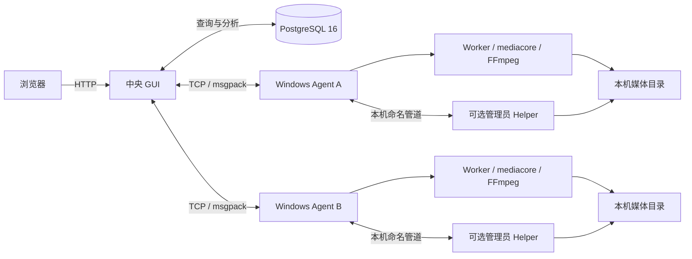

# mySingerServer

面向 Windows 局域网的多机器媒体重复与相似文件分析系统。每台媒体机器运行
Agent，中央 GUI 汇总 PostgreSQL 中的数据并提供 Web 页面，用于扫描媒体、
查看精确重复与相似图片/视频组，以及在明确选择和二次确认后执行可审计删除。

当前 M1～M6 已按项目范围验收完成。M6 的最终状态是
`M6_COMPLETE_OWNER_ACCEPTED`；其长测时长和未单独测量指标的边界见
[M6 验收记录](docs/acceptance/2026-07-29-m6.md)。

## 主要功能

- 使用 SHA-512 识别内容完全相同的文件；
- 使用 PDQ-256、分区 pHash、Sobel 特征和视频六帧复筛相似媒体；
- Agent 本地 SQLite 持久化，断线后继续扫描并恢复上行；
- 中央 PostgreSQL 汇总多台机器的文件和相似组；
- Worker 子进程隔离本地解码崩溃、超时和坏文件；
- Everything IPC 加速枚举，不可用时自动回退到目录遍历；
- Web 页面查看 Agent、任务进度、精确重复、相似图片和相似视频；
- 可选的管理员 Helper 提供软删除、硬删除和删除审计。

## 运行架构



- GUI 和 PostgreSQL 通常部署在一台中央机器上；
- 每台存放媒体的 Windows 机器运行一个 Agent；
- Worker 由 Agent 自动启动，不需要手工运行；
- Helper 只在需要删除功能时部署，并且必须与 Agent 运行在同一台机器、
  同一账号上下文中。

## 运行要求

直接使用已构建程序时需要：

- Windows x64；
- PostgreSQL 16；
- 可选：Docker Desktop 与 Docker Compose，用于快速启动 PostgreSQL；
- 可选：[Everything](https://www.voidtools.com/)，用于加速文件枚举；
- 可信局域网或本机回环环境。

> GUI HTTP、Agent TCP 和 PostgreSQL 示例部署没有应用层鉴权或 TLS。
> 不要把这些端口直接暴露到互联网。

## 节点托盘快速开始

节点日常配置应使用 `nodetray.exe` 的交互式表单，不需要直接编辑 Agent 或
删除 Helper 的 JSON。管理员先按[节点托盘部署说明](docs/deployment/node-tray.md)
准备固定程序目录和运行文件，操作员随后按以下顺序完成单机配置：

1. 启动 `nodetray.exe`。程序进入 Windows 通知区域并打开节点控制台；主窗口
   固定包含“总览”“Agent”“删除 Helper”“程序设置”四个页签。
2. 打开“Agent”页签，通过输入框、选择器和开关填写节点身份、监听地址、
   数据目录、数据库连接、扫描、同步、Worker 数量及其他必要参数。数据库密码
   在界面中以密码控件处理，不要复制到截图、通知或公开日志。
3. 点击“测试配置”，修正所有字段错误后点击“保存”。如果 Agent 已在运行且
   需要立即采用新配置，可明确选择“保存并重启 Agent”；普通“保存”不会隐式
   重启组件。
4. 在“程序设置”页签选择 Agent 的“手动”或“自动”启动方式。需要当前账号
   每次登录后显示托盘时，再启用“登录后启动托盘程序”并保存设置。
5. 返回“Agent”或“总览”页签，点击“启动 Agent”。等待 Agent 显示运行中，
   并确认 Worker 的 `ready / expected` 达到预期。Worker 只读且始终由 Agent
   管理，托盘中没有启动、停止、重启或删除单个 Worker 的入口。
6. 只有需要删除能力时，才在“删除 Helper”页签启用并交互式配置 Helper。
   `allowed_roots` 只加入明确、窄范围的本机媒体目录，默认使用软删除并关闭
   硬删除。保存受保护配置和手动启动会按需请求一次 UAC；自动模式使用固定的
   最高权限登录计划任务。Agent 不会自动启动 Helper。

关闭主窗口默认只是隐藏到托盘，Agent 和 Helper 继续按各自状态运行。退出时
可选“仅退出托盘程序”或“停止组件后退出”。后者先请求组件受控停止；15 秒
停止超时后不会自动强杀，必须由操作员选择等待、取消退出或另行明确处理。

完整的四页签说明、配置备份、WebView2 排障和安全边界见
[节点托盘部署说明](docs/deployment/node-tray.md)。

## 中央端与兼容 CLI 部署

以下流程用于中央 GUI、开发环境、迁移旧节点或无托盘的兼容部署。它保留
CLI/JSON 配置方式，但不是节点操作员的正常日常流程；新节点应优先使用上面的
托盘交互式配置。

以下步骤优先使用仓库已有的 `bin` 目录。当前仓库快照包含核心扫描与分析
程序；如果缺少某个产物，请先按[从源码构建](#从源码构建)生成完整 `bin`。

### 1. 检查核心产物

```powershell
$required = @(
  'bin\agent.exe',
  'bin\gui.exe',
  'bin\worker.exe',
  'bin\mediacore.dll',
  'bin\Everything64.dll',
  'bin\tools\ffmpeg.exe',
  'bin\tools\ffprobe.exe'
)
$missing = @($required | Where-Object { -not (Test-Path -LiteralPath $_) })
if ($missing.Count) {
  throw "缺少运行文件：$($missing -join ', ')"
}
```

`helper.exe` 是删除功能的可选产物。没有它时，扫描、同步和相似分析仍可
使用，但不要提交删除任务。

### 2. 启动 PostgreSQL

开发或本机试用可以使用仓库中的 Compose 文件：

```powershell
docker compose -f .\deploy\docker-compose.yml up -d
docker compose -f .\deploy\docker-compose.yml ps
```

Compose 文件中的数据库账号和密码只是开发示例。正式部署前必须设置新的
凭据，并让 Agent 与 GUI 的 `pg_dsn` 使用同一套实际连接信息。不要把真实
DSN 提交到版本库、截图或公开日志中。

首次创建新数据卷时，Compose 会执行 `deploy/central.sql` 初始化中心库。
已有数据卷不会重复执行初始化脚本；不要为了重新初始化而随意删除生产数据卷。

### 3. 准备配置文件

只在目标文件不存在时复制示例，避免覆盖已经配置好的文件：

```powershell
if (-not (Test-Path .\bin\agent.json)) {
  Copy-Item .\deploy\agent.example.json .\bin\agent.json
}
if (-not (Test-Path .\bin\gui.json)) {
  Copy-Item .\deploy\gui.example.json .\bin\gui.json
}
if (-not (Test-Path .\bin\helper.json)) {
  Copy-Item .\deploy\helper.example.json .\bin\helper.json
}
```

编辑 `bin\agent.json`：

```json
{
  "listen_addr": "0.0.0.0:9101",
  "data_dir": "./data",
  "pg_dsn": "<填写实际 PostgreSQL DSN>",
  "use_everything": true
}
```

示例只展示必改字段；建议在完整的
[Agent 示例配置](deploy/agent.example.json)上修改，以保留扫描、同步、删除
和统计参数。机器 ID 会根据 CPU ID、主板序列号和 Windows MachineGuid 自动计算为
`node-<64 位 SHA-256>`，无需填写；`data_dir` 必须可写。

编辑中央机器上的 `bin\gui.json`：

```json
{
  "listen_addr": "127.0.0.1:8080",
  "pg_dsn": "<填写与 Agent 相同的 PostgreSQL DSN>",
  "heartbeat_s": 15,
  "agents": [
    {
      "addr": "127.0.0.1:9101"
    }
  ]
}
```

GUI 只配置 Agent 地址，连接成功后采用 Agent 在握手中上报的自动生成 ID。
多机部署时，把 `addr` 改为该 Agent 的可信局域网地址，并在 `agents` 数组中继续添加机器。

### 4. 启动 Agent

在媒体机器上打开 PowerShell：

```powershell
Set-Location D:\path\to\mySingerServer
.\bin\agent.exe -config .\bin\agent.json
```

保持窗口运行。Agent 会自动启动 `worker.exe`，并从 `bin\tools` 使用
ffmpeg/ffprobe。Everything SDK 或 Everything IPC 不可用时会记录警告并
回退到目录遍历。

### 5. 启动 GUI

在中央机器的另一个 PowerShell 窗口中运行：

```powershell
Set-Location D:\path\to\mySingerServer
.\bin\gui.exe -config .\bin\gui.json
```

默认配置下，在浏览器打开：

<http://127.0.0.1:8080/>

页面应打开 V4 React 工作台，可在“总览、Agent、扫描任务、一筛分析、
重复组、删除审计”六个工作区间切换。旧页面只读回退入口为
`/legacy.html`，旧重复组入口为 `/legacy-groups.html`。

### 6. 可选：启用删除 Helper

删除功能需要完整构建产生的 `bin\helper.exe`。先编辑
[Helper 示例配置](deploy/helper.example.json)，把 `allowed_roots` 设置为
明确、窄范围的本地媒体目录，例如：

```json
{
  "allowed_roots": [
    "D:\\Media"
  ],
  "default_mode": "soft",
  "allow_hard_delete": false
}
```

不要把盘符根、Windows 系统目录、整个用户目录或不属于本项目的目录加入
白名单。然后从提升权限的 PowerShell 启动 Helper：

```powershell
Start-Process -Verb RunAs `
  -FilePath (Resolve-Path '.\bin\helper.exe') `
  -ArgumentList '-config', 'helper.json' `
  -WorkingDirectory (Resolve-Path '.\bin')
```

Helper 默认不会由 Agent 自动启动或重启。Agent 与 Helper 必须由同一账号
运行，否则命名管道访问可能被拒绝。完整部署要求见
[Helper 部署说明](docs/deployment/m5-helper.md)。

## 日常使用

### 扫描媒体

1. 打开 GUI 的“Agent”工作区，确认目标 Agent 显示“在线”；
2. 切换到“扫描任务”工作区；
3. 选择 Agent；
4. 输入该 Agent 所在机器上的本地绝对目录；
5. 多个根目录使用 `|` 分隔，例如 `D:\Media|E:\Photos`；
6. 点击“开始普扫”，在任务表中观察完成、跳过、失败和速度。

Web 页面中的路径由目标 Agent 解释，不是 GUI 中央机器的路径。不要输入
网络共享路径、相对路径或另一台机器才存在的盘符。

### 查看精确重复

GUI 的“重复组”工作区默认显示 SHA-512 精确重复组，也可切换相似图片和
相似视频。列表采用服务端每页 100 组和可视行虚拟化；点击一组可查看机器、
文件路径、大小、修改时间和评分，不会把百万级结果一次性加载到浏览器。

### 运行相似分析

扫描结果同步到 PostgreSQL 后，可以启动一筛分析：

```powershell
Invoke-RestMethod `
  -Method Post `
  -Uri 'http://127.0.0.1:8080/api/analysis/firstscreen/run'

Invoke-RestMethod `
  -Method Get `
  -Uri 'http://127.0.0.1:8080/api/analysis/firstscreen/status'
```

也可以直接在“一筛分析”工作区触发并查看状态。Agent 默认每 5 分钟同步
一次，积压达到 50,000 行时也会提前触发。分析成功后，GUI 会自动下发需要
的二阶段特征任务；处理完成后访问：

<http://127.0.0.1:8080/groups>

该页面可以在“精确重复”“相似图片”“相似视频”之间切换。

### 安全删除

删除页只处理用户明确勾选的成员：

1. 在组详情中勾选要删除的具体文件；
2. 点击“删除所选”；
3. 检查服务端重新确认的文件数量和字节数；
4. 选择软删除或管理员允许的硬删除；
5. 点击“最终确认删除”；
6. 查看任务进度和失败明细。

未加载、未勾选、离线机器上的文件不会因为“属于同一组”而自动进入删除任务。
软删除是默认模式；硬删除不可恢复，仅在 `allow_hard_delete=true` 且用户明确
选择后允许执行。

## 多机部署

每台媒体机器使用相同程序包、独立配置：

```json
{
  "listen_addr": "0.0.0.0:9101",
  "data_dir": "D:\\DedupData",
  "pg_dsn": "<填写实际 PostgreSQL DSN>",
  "use_everything": true
}
```

中央 GUI 配置列出所有 Agent：

```json
{
  "agents": [
    {
      "addr": "192.0.2.10:9101"
    },
    {
      "addr": "192.0.2.11:9101"
    }
  ]
}
```

`192.0.2.0/24` 是文档示例网段，请替换为实际可信局域网地址。部署时：

- Windows 防火墙只允许 GUI 主机访问 Agent 监听端口；
- PostgreSQL 只允许 Agent 和 GUI 主机访问；
- GUI 默认监听 `127.0.0.1`；如需局域网访问，使用反向代理、主机防火墙或
  VPN 限制来源；
- 不要使用端口映射、路由器转发或公网安全组把服务直接发布到互联网；
- 每台需要删除功能的 Agent 都要在本机单独部署 Helper 和白名单。

## 节点本机控制面与托盘（开发者）

Agent 和删除 Helper 已提供仅限同机访问的独立命名管道控制面，用于读取组件
状态和请求受控关闭。Agent 控制面会汇总 Worker 状态；Helper 控制面与既有删除
事务管道严格分离。Agent 的业务 TCP 端口不接受生命周期控制命令，管理程序也
不应直接操作 Worker。

静态检查不会启动进程或连接 PostgreSQL：

```powershell
pwsh -NoProfile -File .\tests\windows\Test-NodeControlPlane.ps1 -WhatIf
```

固定管道、ACL、协议兼容边界、动态验收参数和安全限制见
[节点本机控制面部署说明](docs/deployment/node-control-plane.md)。`nodetray.exe`
在此控制面之上提供常驻通知区域、四页签交互式配置、Agent/Helper 手动或自动
启动以及登录后启动选项；自动生成的机器 ID 只在概览页显示，不提供编辑；部署与操作细节见
[节点托盘部署说明](docs/deployment/node-tray.md)。发布包、代码签名、WebView2
引导程序和真实 Windows 动态验收仍以各自验收记录为准，不能仅凭文档视为已完成。

## 配置说明

### `agent.json`

| 字段 | 作用 | 常用值或说明 |
|---|---|---|
| `listen_addr` | GUI 连接 Agent 的 TCP 地址 | 默认 `0.0.0.0:9101` |
| `data_dir` | SQLite、日志和缩略图目录 | 必须是可写目录 |
| `pg_dsn` | PostgreSQL 连接 | 必填；不要写入公开日志 |
| `use_everything` | 是否优先使用 Everything | 默认 `true`，失败时回退 Walker |
| `scan.*` | HDD/SSD 流数、超时、媒体扩展名 | 建议先保留示例默认值 |
| `sync.*` | 同步周期、积压触发、批量大小 | 默认 300 秒、50,000 行、5,000 行 |
| `delete.*` | Helper 管道和超时 | Agent 与 Helper 必须一致 |
| `tuning.*` | stats、背压和可选 pprof | `pprof_addr` 只允许回环地址 |

未写入的 Worker、FFmpeg、缩略图和 IPC 字段会使用程序默认值；完整字段定义见
[Agent 配置加载器](internal/config/agent.go)。

### `gui.json`

| 字段 | 作用 | 常用值或说明 |
|---|---|---|
| `listen_addr` | Web GUI HTTP 地址 | 默认 `127.0.0.1:8080` |
| `pg_dsn` | 中央 PostgreSQL 连接 | 必填；与 Agent 指向同一中心库 |
| `heartbeat_s` | Agent 心跳周期 | 默认 15 秒 |
| `agents` | Agent 地址列表 | 至少一项，`addr` 不得重复；机器 ID 在握手后取得 |
| `firstscreen.*` | 一筛阈值和分页参数 | 建议保留默认值 |
| `phase2.*` | 二阶段阈值、分片和自动下发 | 默认自动下发 |

完整字段定义见 [GUI 配置加载器](internal/config/gui.go)。

### `helper.json`

| 字段 | 作用 | 常用值或说明 |
|---|---|---|
| `pipe_name` | Agent 与 Helper 的本机命名管道 | 默认 `\\.\pipe\dedup-delete` |
| `allowed_roots` | 允许删除的本地媒体根 | 默认空；部署前必须窄范围配置 |
| `denied_roots` | 额外拒绝目录 | 不要移除系统保护项 |
| `default_mode` | 默认删除模式 | `soft` 或 `hard`，推荐 `soft` |
| `allow_hard_delete` | 是否允许硬删除 | 不需要时设为 `false` |
| `recycle_dir_name` | 软删除回收目录名称 | 默认 `$DedupRecycle` |
| `log_dir` | Helper 日志目录 | 空值使用程序默认位置 |

Helper 会拒绝盘符根、系统目录、宽泛用户目录、回收目录本身和白名单外路径。

## 数据与日志

Agent 的 `data_dir` 中包含：

| 路径 | 内容 |
|---|---|
| `agent.db` | 本地 SQLite 文件、特征和同步队列 |
| `agent.log` | Agent 运行日志 |
| `errors.log` | 文件级和任务级错误 |
| `crash.log` | Worker 崩溃记录 |
| `delete.log` | 删除任务与结果审计 |
| `stats.log` | 性能统计 JSONL |
| `thumbcache\` | 视频缩略图缓存 |

停止进程前使用 `Ctrl+C`，让 Agent、GUI 和 Helper完成正常收尾。升级前备份
`data_dir` 和 PostgreSQL；不要在进程运行时直接修改 `agent.db`。

## 从源码构建

### 构建环境

- Go 1.22+；
- Node.js 22.15+ 与 npm 10.9+（用于测试并生成内嵌 React 页面）；
- Visual Studio 2022，包含 C++ x64 工具链；
- CMake 3.20+ 和相邻的 CTest；
- vcpkg，默认根目录 `C:\vcpkg`；
- MinGW-w64 GCC、windres、dlltool；
- PowerShell 7；
- 仓库中已准备的 Everything SDK 和 FFmpeg 运行文件。

`mediacore.dll` 由 MSVC/CMake/vcpkg 构建；`worker.exe` 和 Helper 相关产物
还需要 MinGW 工具。执行：

```powershell
pwsh -NoProfile -File .\scripts\build.ps1 `
  -Go go `
  -CC gcc `
  -Windres windres `
  -Dlltool dlltool `
  -CMake cmake `
  -VcpkgRoot C:\vcpkg `
  -OutDir bin
```

脚本会先以锁文件恢复前端依赖，运行 React 测试、lint 和构建，安全替换
`internal\gui\web` 的内嵌产物；随后构建并验证本地 DLL，再生成和打包：

- `agent.exe`
- `gui.exe`
- `helper.exe`
- `worker.exe`
- `mediacore.dll`
- `Everything64.dll`
- `tools\ffmpeg.exe`、`tools\ffprobe.exe` 及其运行 DLL
- 首次不存在时复制的 `agent.json`、`gui.json`、`helper.json`

如果工具不在 PATH，可把参数值改成对应可执行文件的绝对路径。构建脚本不会
覆盖已经存在的三份运行配置。

### 只验证 Web 界面

只改前端时可以单独生成并验证 Go 内嵌资源：

```powershell
pwsh -NoProfile -File .\scripts\build-web.ps1
pwsh -NoProfile -File .\scripts\build-web.ps1 -VerifyEmbedded
```

构建完成后，可启动仅绑定 `127.0.0.1` 的浏览器验收夹具：

```powershell
node .\scripts\acceptance-web-fixture.mjs
```

夹具只提供内存中的百万级分页元数据和模拟任务状态，不连接真实 PostgreSQL、
Agent 或 Helper，也不会删除文件；它不能替代真实部署验收。

## 常见问题

| 现象 | 检查与处理 |
|---|---|
| GUI 启动时报 PostgreSQL 不可达 | 检查 PostgreSQL 16 是否 healthy、端口是否可达，以及 GUI 的 `pg_dsn` 是否与实际部署一致 |
| Agent 启动但 GUI 显示离线 | 核对 GUI 的 Agent 地址、Agent 的 `listen_addr`、状态页上报 ID 和 Windows 防火墙 |
| Agent 启动时报 DSN 解析失败 | 检查 `pg_dsn` 格式；不要把完整连接内容复制到公开问题或日志中 |
| Everything 不可用 | 确认 Everything 正在运行且 `Everything64.dll` 与 Agent 同目录；系统会自动回退目录遍历 |
| Worker 不断重启或无法 Ready | 确认 `worker.exe`、`mediacore.dll` 位于 Agent 同目录，并检查 `crash.log`、`errors.log` |
| 视频处理失败 | 确认 `bin\tools\ffmpeg.exe`、`ffprobe.exe` 和运行 DLL 完整，查看 `errors.log` |
| 扫描找不到目录 | Web 中必须填写目标 Agent 机器上的本地绝对路径，而不是 GUI 机器的路径 |
| 相似组没有更新 | 等待 Agent 上行同步，再调用一筛分析 API；检查状态接口的 `last_err` |
| 删除按钮失败或 Helper 不可达 | 确认本机 `helper.exe` 已提升权限运行、账号与 Agent 相同、管道名一致 |
| Helper 报配置无效 | `allowed_roots` 不能为空，且必须是窄范围、存在的本地目录 |
| 软删除后文件在哪里 | 位于配置根内的 `$DedupRecycle`；不要手工把该目录加入扫描或删除白名单 |

## 安全边界

- 本项目按可信局域网设计，没有互联网暴露所需的认证、授权和 TLS；
- PostgreSQL DSN、密码和部署凭据只能保存在受控配置中；
- Agent 不自动提权，也不负责启动、停止或重启 Helper；
- Helper 只接受受保护命名管道和 `allowed_roots` 内的明确路径；
- 删除任务只包含用户显式勾选的文件，并要求服务端准备和最终确认；
- 软删除可恢复，硬删除不可恢复；没有明确需求时关闭硬删除；
- 不要把盘符根、系统目录、整个用户目录或其他项目的数据目录设为删除根；
- 不要自动清理媒体目录、生成语料目录、Agent 数据库或 PostgreSQL 数据卷。

## HTTP 接口

主要接口：

| 方法与路径 | 用途 |
|---|---|
| `GET /api/agents` | Agent 状态 |
| `POST /api/scan` | 下发扫描 |
| `GET /api/tasks` | 任务状态 |
| `GET /api/dup_groups` | 精确重复组 |
| `POST /api/analysis/firstscreen/run` | 启动一筛 |
| `GET /api/analysis/firstscreen/status` | 一筛状态 |
| `GET /api/groups` | 精确、图片、视频组分页 |
| `GET /api/groups/{id}` | 组详情与分数 |
| `POST /api/delete/prepare` | 删除前重新确认 |
| `POST /api/delete/execute` | 使用确认令牌提交删除 |
| `GET /api/delete/tasks/{task_id}` | 删除进度 |

这些接口没有业务鉴权。需要远程访问时，应由受控反向代理或 VPN 提供访问
控制，不应直接公网开放。

## 项目文档

- [总体架构](docs/architecture-plan.md)
- [M1～M6 实施状态](docs/todolist.md)
- [M2 原生媒体核心](mediacore/README.md)
- [Helper 部署与权限](docs/deployment/m5-helper.md)
- [节点本机控制面](docs/deployment/node-control-plane.md)
- [节点托盘部署与使用](docs/deployment/node-tray.md)
- [节点托盘验收记录模板](docs/acceptance/node-tray-acceptance.md)
- [M2 验收](docs/acceptance/2026-07-27-m2.md)
- [M3 验收](docs/acceptance/2026-07-28-m3.md)
- [M4 验收](docs/acceptance/2026-07-28-m4.md)
- [M5 验收](docs/acceptance/2026-07-29-m5.md)
- [M6 最终验收与边界](docs/acceptance/2026-07-29-m6.md)
- [README 设计说明](docs/superpowers/specs/2026-07-30-readme-design.md)
