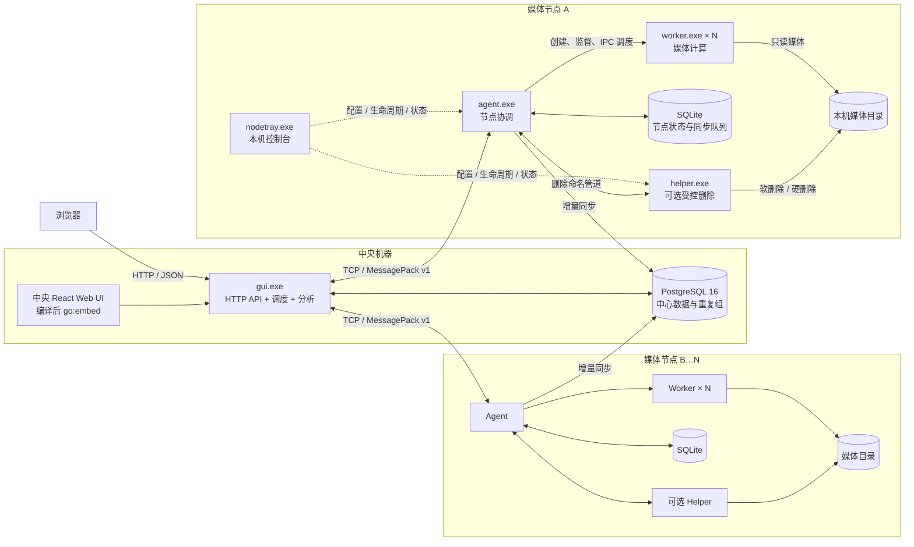
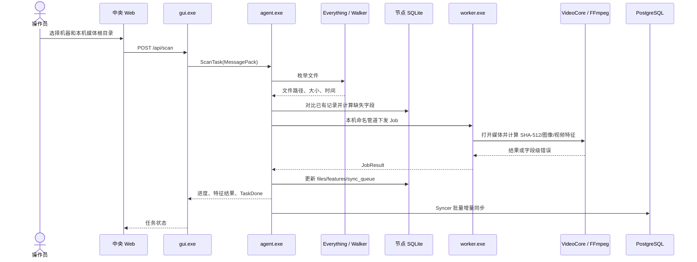
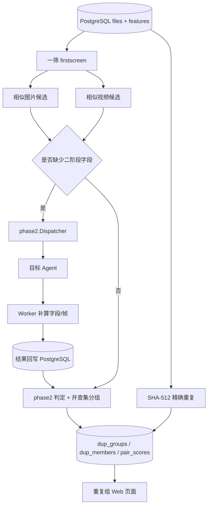
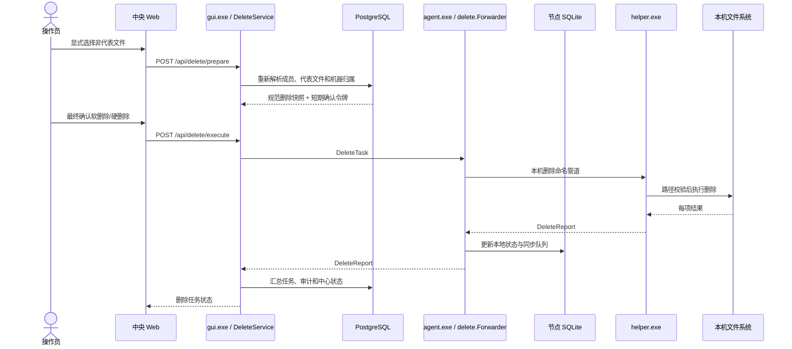
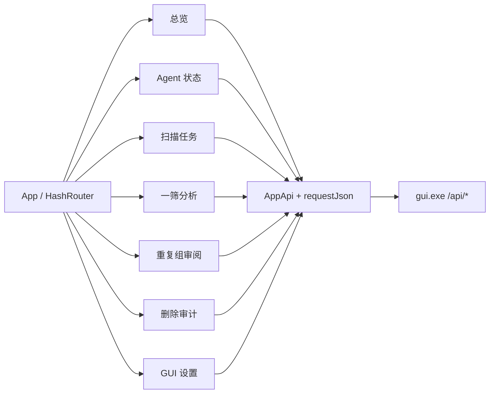
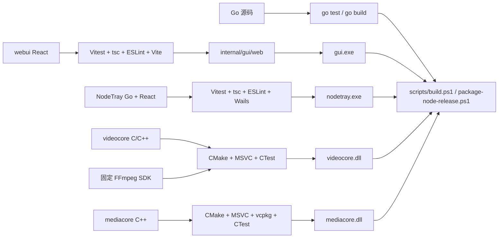

# mySingerServer 当前工程架构与模块依赖

> 文档日期：2026-08-04  
> 基线：当前工作区源码快照  
> 定位：描述现在已经实现的工程结构；`docs/architecture-plan.md` 保留为早期架构选型和演进计划。

## 1. 系统定位

mySingerServer 是一个面向 Windows 多机器媒体目录的去重系统。系统把职责拆分为中央协调、节点扫描、媒体计算、受控删除和本机管理五类边界：

- **中央 GUI**：提供 Web 页面、连接多台 Agent、下发任务、运行一筛和二阶段分析、查询 PostgreSQL、协调删除任务。
- **Agent**：部署在媒体节点，负责目录枚举、任务编排、本地 SQLite、Worker 生命周期和向 PostgreSQL 同步。
- **Worker**：由 Agent 创建，通过本机 IPC 接收媒体任务，调用 VideoCore、FFmpeg 等完成哈希和特征计算。
- **删除 Helper**：可选的本机独立进程，接收 Agent 转发的删除任务并执行软删除或硬删除。
- **节点托盘程序 NodeTray**：Wails 桌面程序，负责本机配置、状态展示以及 Agent、Worker、Helper 的启动、停止和退出编排；不执行媒体计算或删除。

机器身份不再由配置文件指定。Agent、Helper 和 NodeTray 根据 CPU ID、主板序列号和 Windows MachineGuid 计算同一个 `node-<64位小写SHA-256>`，中央 GUI 只配置 Agent 地址并在握手后采用 Agent 上报的机器唯一 ID。

## 2. 总体运行架构



### 2.1 进程所有权

| 进程 | 由谁启动或管理 | 主要所有权 |
|---|---|---|
| `gui.exe` | 中央机器操作员 | HTTP 服务、Agent 连接池、分析和删除协调 |
| `agent.exe` | NodeTray 或操作员 | 枚举、SQLite、同步、Worker 池、业务 TCP 服务 |
| `worker.exe` | 仅由 Agent | 单个媒体任务的特征计算 |
| `helper.exe` | NodeTray 或操作员，可选 | 本机文件删除 |
| `nodetray.exe` | 媒体节点操作员 | 本机配置和组件生命周期 |
| 浏览器 | 操作员 | 调用中央 GUI HTTP API，不直连 Agent |

日常“停止 Agent”由 Agent 的优雅关闭流程回收 Worker，NodeTray 不单独停止 Worker。用户选择“退出 NodeTray”时是独立的完整强制退出流程：先记录当前 Worker PID，再强制停止可信认领的 Helper 和 Agent，等待已记录的 Worker 全部消失，最后才关闭 NodeTray UI。

## 3. 核心业务数据流

### 3.1 扫描与特征计算



关键边界：

- Agent 负责枚举和任务拆分，不在业务 TCP 连接线程中直接计算媒体特征。
- Worker 通过本机命名管道通信；每个 Worker 由 Agent 监督，不能作为独立服务使用。
- `use_everything=true` 时优先使用 Everything；不可用时回退普通目录遍历。
- 节点 SQLite 是扫描期间的本地事实来源，`sync_queue` 驱动到 PostgreSQL 的增量同步。
- Worker 当前默认通过 `videocore.dll` 的 C ABI 使用 FFmpeg 库；独立 `ffmpeg.exe`/`ffprobe.exe` 仍用于兼容媒体处理路径和工具型操作。

### 3.2 一筛与二阶段分析



- `internal/firstscreen` 负责精确重复、相似图片和相似视频的一筛候选生成。
- `internal/phase2` 负责候选补算调度、复筛判定、并查集合并和重复组持久化。
- 中央 GUI 直接访问 PostgreSQL；浏览器只通过 GUI HTTP API 访问分析结果。

### 3.3 删除链路



删除 Helper 是可选边界。未启用 Helper 时扫描和分析仍可工作，但删除任务不可执行。软删除默认移动到配置根目录中的回收目录；硬删除必须由 Helper 配置显式允许。

## 4. 源码目录结构

```text
mySingerServer/
├─ cmd/                         Go 可执行程序入口
│  ├─ agent/                    Agent
│  ├─ worker/                   Worker
│  ├─ helper/                   删除 Helper
│  ├─ gui/                      中央 GUI
│  └─ bench*/corpusgen/...      基准、语料、报告和驻留测试工具
├─ internal/                    Go 内部包
│  ├─ agent/                    扫描、业务 TCP、二阶段和删除转发
│  ├─ worker/                   Worker 池、监督、IPC 和任务模型
│  ├─ wproc/                    Worker 运行时和媒体流水线
│  │  ├─ videocore/             当前 VideoCore C ABI 绑定
│  │  └─ mediacore/             旧 MediaCore 兼容绑定
│  ├─ store/                    Agent 本地 SQLite
│  ├─ syncer/                   SQLite 到 PostgreSQL 增量同步
│  ├─ gui/                      中央 HTTP API、连接池、配置和删除服务
│  ├─ firstscreen/              精确重复与一筛
│  ├─ phase2/                   二阶段调度、判定和分组
│  ├─ helper/                   删除验证与执行
│  ├─ nodetray/                 节点托盘后端分层
│  ├─ proto/                    GUI 与 Agent 的 MessagePack 协议
│  ├─ nodectl/                  NodeTray 本机控制协议
│  ├─ config/                   Agent/GUI 配置模型与校验
│  ├─ machineid/                硬件机器唯一 ID
│  └─ features/stats/...        共享特征、统计和基础能力
├─ webui/                       中央 React Web UI
├─ nodetray/
│  ├─ frontend/                 NodeTray React UI
│  ├─ composition*.go           Wails/Windows 生产组合
│  └─ build/                    Wails 清单、图标和生成产物
├─ videocore/                   当前原生媒体会话库，C/C++ + FFmpeg SDK
├─ mediacore/                   旧媒体算法库，C++ + PDQ + 图像库
├─ deploy/                      JSON 示例、PostgreSQL DDL、Compose 和部署说明
├─ scripts/                     构建、打包、供应链和阶段验收脚本
├─ tests/ integration/ testdata/测试与夹具
├─ third_party/                 固定的 FFmpeg、Everything、WebView2 等依赖
├─ docs/                        设计、计划、部署、验收和本架构文档
├─ bin/                         本地构建/运行目录，不是源码事实来源
└─ artifacts/                   发布、验证和阶段产物，不是源码事实来源
```

## 5. Go 模块依赖关系

### 5.1 可执行入口依赖

| 入口 | 直接依赖的工程包 | 说明 |
|---|---|---|
| `cmd/agent` | `agent`、`agent/delete`、`agentcontrol`、`config`、`enum`、`machineid`、`nodectl`、`stats`、`store`、`syncer`、`worker` | 组装整个媒体节点运行时 |
| `cmd/worker` | `wproc` | Worker 入口保持很薄，计算能力在 `internal/wproc` |
| `cmd/helper` | `helper`、`helpercontrol`、`machineid`、`nodectl` | 删除服务和本机控制面 |
| `cmd/gui` | `config`、`firstscreen`、`gui`、`phase2`、`proto` | 中央 HTTP、连接池、分析和删除协调 |
| `nodetray` | `machineid`、`nodectl`、`internal/nodetray/*` | Wails 桌面组合和本机组件管理 |
| `cmd/bench*`、`corpusgen`、`perfreport`、`soakrun` | `m6bench` 或目标分析包 | 开发和验收工具，不参与生产请求链路 |

### 5.2 内部包分层

| 分层 | 包 | 主要依赖方向 |
|---|---|---|
| 共享模型 | `config`、`features`、`proto`、`nodectl`、`machineid` | 尽量不依赖业务上层；被各运行边界复用 |
| Agent 编排 | `agent` | → `config`、`diskmap`、`enum`、`proto`、`store`、`worker` |
| Agent 删除转发 | `agent/delete` | → `agent`、`config`、`proto` |
| Agent 控制面 | `agentcontrol` | → `nodectl`、`worker` |
| 本地数据 | `store` | → `features`、`proto` |
| 中心同步 | `syncer` | → `store` |
| Worker 管理 | `worker` | → `features`、`store` |
| Worker 计算 | `wproc` | → `features`、`worker`、`wproc/videocore`、兼容 `wproc/mediacore` |
| Helper | `helper` | → `proto` |
| Helper 控制面 | `helpercontrol` | → `nodectl` |
| 中央服务 | `gui` | → `config`、`firstscreen`、`machineid`、`proto` |
| 一筛 | `firstscreen` | 独立算法与 PostgreSQL 存储接口 |
| 二阶段 | `phase2` | → `config`、`features`、`proto` |
| NodeTray 应用层 | `nodetray/app` | → `nodectl`、`nodetray/config`、`traymodel`、Windows elevation/task |
| NodeTray 生产组合 | `nodetray/production` | → `machineid`、`nodectl`、`app`、`bootstrap`、`config`、`process`、`supervisor`、`traymodel` |
| NodeTray 监督 | `nodetray/supervisor` | → `nodectl`、`process`、`traymodel` |
| NodeTray 平台层 | `nodetray/windows/*` | Windows 托盘、单实例、登录启动、UAC、任务和进程能力 |

### 5.3 高层源码依赖图

```mermaid
flowchart TD
    subgraph Entrypoints["可执行入口"]
        C_GUI["cmd/gui"]
        C_AGENT["cmd/agent"]
        C_WORKER["cmd/worker"]
        C_HELPER["cmd/helper"]
        C_TRAY["nodetray"]
    end

    subgraph CenterPackages["中央业务包"]
        GUI_P["internal/gui"]
        FIRST["internal/firstscreen"]
        PHASE2["internal/phase2"]
    end

    subgraph AgentPackages["Agent 业务包"]
        AGENT_P["internal/agent"]
        DELETE_FWD["internal/agent/delete"]
        ENUM["internal/enum + diskmap"]
        STORE["internal/store"]
        SYNC["internal/syncer"]
        WORKER_POOL["internal/worker"]
        STATS["internal/stats"]
    end

    subgraph WorkerPackages["Worker 计算包"]
        WPROC["internal/wproc"]
        VC_BIND["wproc/videocore"]
        MC_BIND["wproc/mediacore<br/>兼容"]
        VC_NATIVE["videocore.dll"]
        MC_NATIVE["mediacore.dll<br/>旧路径"]
    end

    subgraph HelperPackages["Helper 包"]
        HELPER_P["internal/helper"]
        HELPER_CTRL["internal/helpercontrol"]
    end

    subgraph TrayPackages["NodeTray 包"]
        TRAY_PROD["nodetray/production"]
        TRAY_APP["nodetray/app"]
        TRAY_SUP["nodetray/supervisor"]
        TRAY_PLATFORM["nodetray/windows/*"]
    end

    subgraph Shared["共享基础包"]
        CONFIG["config"]
        PROTO["proto"]
        FEATURES["features"]
        NODECTL["nodectl"]
        MACHINEID["machineid"]
    end

    C_GUI --> GUI_P
    C_GUI --> FIRST
    C_GUI --> PHASE2
    C_AGENT --> AGENT_P
    C_AGENT --> DELETE_FWD
    C_AGENT --> STORE
    C_AGENT --> SYNC
    C_AGENT --> WORKER_POOL
    C_AGENT --> STATS
    C_WORKER --> WPROC
    C_HELPER --> HELPER_P
    C_HELPER --> HELPER_CTRL
    C_TRAY --> TRAY_PROD

    GUI_P --> CONFIG
    GUI_P --> PROTO
    PHASE2 --> FEATURES
    PHASE2 --> PROTO
    AGENT_P --> ENUM
    AGENT_P --> STORE
    AGENT_P --> WORKER_POOL
    AGENT_P --> PROTO
    DELETE_FWD --> PROTO
    STORE --> FEATURES
    STORE --> PROTO
    SYNC --> STORE
    WORKER_POOL --> STORE
    WORKER_POOL --> FEATURES
    WPROC --> WORKER_POOL
    WPROC --> VC_BIND
    WPROC -.->|"兼容/旧流水线"| MC_BIND
    VC_BIND --> VC_NATIVE
    MC_BIND --> MC_NATIVE
    HELPER_P --> PROTO
    HELPER_CTRL --> NODECTL
    TRAY_PROD --> TRAY_APP
    TRAY_PROD --> TRAY_SUP
    TRAY_PROD --> MACHINEID
    TRAY_APP --> NODECTL
    TRAY_APP --> TRAY_PLATFORM
    C_AGENT --> MACHINEID
    C_HELPER --> MACHINEID
```



## 6. 前端架构

### 6.1 中央 Web UI：`webui/`

技术栈：React 19、TypeScript、React Router、TanStack Virtual、Vite、Vitest。



重要结构：

- `src/api/contracts.ts`：前后端领域合同。
- `src/api/appApi.ts`：JSON 字段映射和 HTTP 调用。
- `src/features/*`：按页面能力分包。
- `src/hooks/*`：轮询、分页和显式选择状态。
- `src/components/*`：应用壳、弹窗、虚拟表格等共享组件。
- Vite 构建输出写入 `internal/gui/web/`，由 `internal/gui/web.go` 使用 `go:embed` 嵌入 `gui.exe`。

### 6.2 NodeTray UI：`nodetray/frontend/`

技术栈：React 19、TypeScript、Vite、Vitest、Wails 绑定。

- **概览**：机器唯一 ID、Agent/Worker/Helper 状态和组件操作。
- **Agent**：Agent 配置，不允许编辑机器唯一 ID。
- **Helper**：启用状态、删除根目录、软/硬删除配置。
- **程序设置**：启动模式、登录启动和应用级设置。
- `src/bindings/backend.ts` 封装 Wails 后端调用；`wailsjs/go/*` 为 Wails 生成绑定。
- `src/state/nodeStore.ts` 和 `NodeStateContext` 维护当前界面状态，保存成功后刷新所有相关页面状态。
- 前端构建到 `nodetray/frontend/dist/`，再由 Wails 打包进 `nodetray.exe`。

两套 React 前端完全独立：中央 Web 通过 HTTP 调用 `gui.exe`；NodeTray 前端通过 Wails 桥调用本机 Go 后端。

## 7. 协议与连接关系

| 通道 | 两端 | 编码/实现 | 用途 |
|---|---|---|---|
| HTTP | 浏览器 ↔ GUI | JSON + 内嵌静态资源 | 状态、扫描、分析、重复组、删除、配置 |
| 业务 TCP | GUI ↔ Agent | `internal/proto`，MessagePack，协议版本 1 | Hello、心跳、扫描、二阶段、删除、统计和任务结果 |
| Worker IPC | Agent ↔ Worker | Windows 命名管道 + `internal/worker` 消息 | Ready、Job、结果、查询和关闭 |
| 删除 IPC | Agent ↔ Helper | Windows 命名管道 + `internal/proto` 删除消息 | 删除任务和逐项报告 |
| 本机控制 IPC | NodeTray ↔ Agent/Helper | `internal/nodectl`，MessagePack，协议版本 1 | Status、Shutdown 和组件身份/指纹 |
| Wails 桥 | NodeTray React ↔ Go 后端 | Wails 生成绑定 | 本机 UI 操作和事件 |
| PostgreSQL | GUI/Agent ↔ PostgreSQL | `pgx/v5` | 中央数据、同步、分析和任务状态 |
| SQLite | Agent ↔ 本地数据库 | `modernc.org/sqlite` | 本地文件、特征和同步队列 |
| C ABI | Worker ↔ VideoCore | cgo + `videocore.dll` | 媒体会话、SHA-512、图像/视频特征 |

### 7.1 GUI 与 Agent 身份认领

1. `gui.json` 的 `agents` 仅保存 `addr`。
2. GUI 按地址建立 TCP 连接，连接建立但 Hello 未完成时状态为 `pending`。
3. Agent Hello 上报自动生成的机器唯一 ID。
4. 第一个成功认领该 ID 的在线连接状态为 `claimed` 并可参与调度。
5. 同一 ID 的后续连接状态为 `conflict`，不能参与调度。
6. 原认领连接断开后释放 ID，其他 endpoint 可在重连时重新认领。

## 8. 数据存储与所有权

### 8.1 Agent 本地 SQLite

| 表 | 所有权和用途 |
|---|---|
| `files` | 机器内文件路径、元数据、哈希、处理状态和缺失字段 |
| `image_features` | 图像 PDQ、质量、尺寸、pHash 分片、Sobel 等 |
| `video_features` | 视频时长、缩略图和相关特征 |
| `video_frames` | 标准采样帧特征 |
| `sync_queue` | 等待同步到 PostgreSQL 的本地变更 |

本地记录以机器唯一 ID 和本机路径为业务归属。Agent 先更新 SQLite，再由 Syncer 批量同步中心库。

### 8.2 中央 PostgreSQL

| 表 | 所有权和用途 |
|---|---|
| `files` | 汇总所有机器的文件记录，唯一键为 `(machine_id, path)` |
| `image_features`、`video_features`、`video_frames` | 按内容 SHA-512 聚合的中心特征 |
| `dup_groups`、`dup_members` | 精确重复、候选组和最终相似组 |
| `pair_scores` | 二阶段内容对判定结果 |
| `scan_tasks` | 中央扫描任务状态 |

PostgreSQL 是中央查询和分析事实来源；浏览器不直接访问数据库。

### 8.3 配置和生成资源

| 数据 | 读写者 | 说明 |
|---|---|---|
| `agent.json` | Agent、NodeTray | 监听、数据目录、同步、扫描和 Worker 参数；不保存机器唯一 ID |
| `helper.json` | Helper、NodeTray | 删除根、模式、管道和删除限制 |
| `gui.json` | GUI、中央 Web 配置页 | HTTP 地址、PostgreSQL、一筛/二阶段和 Agent endpoint 地址 |
| `internal/gui/web/` | Web 构建脚本、GUI | 生成目录，由 `webui` 构建后嵌入 GUI |
| `nodetray/frontend/dist/` | NodeTray 前端构建、Wails | 生成目录，由 Wails 嵌入 NodeTray |
| `bin/`、`artifacts/` | 构建和发布脚本 | 产物目录，不应作为源码模块导入 |

GUI 配置保存会在 `-config` 指定文件的同一目录创建临时文件并原子替换，因此该目录必须对 GUI 运行账号可写。可执行文件可以放在 `Program Files`，配置应放在 `%LOCALAPPDATA%`、`ProgramData` 中已授权的目录或其他可写目录。

## 9. 原生媒体模块

### 9.1 VideoCore：当前默认运行时

- 目录：`videocore/`。
- C/C++ 动态库：`videocore.dll`。
- Go 绑定：`internal/wproc/videocore`。
- 依赖固定的 FFmpeg MSVC SDK：`avformat`、`avcodec`、`avutil`、`swscale`，运行时还需要 `swresample`。
- 提供媒体会话、取消、超时、SHA-512、图像分析、视频六帧、时长和接触表等能力。
- Worker 启动时校验 VideoCore ABI、组件主版本和 FFmpeg 构建/运行版本。

### 9.2 MediaCore：兼容与旧算法路径

- 目录：`mediacore/`。
- C++ 动态库：`mediacore.dll`。
- 依赖 libjpeg-turbo、libpng、libwebp、PDQ 源码和 Windows bcrypt。
- Go 绑定位于 `internal/wproc/mediacore`；完整旧 DLL 绑定受 `legacy_mediacore` 构建标签控制。
- 当前默认 Worker 会话流水线使用 VideoCore；MediaCore 目录仍承载兼容算法、旧流水线和独立验收资产。

## 10. 外部依赖

| 依赖 | 使用模块 | 作用 |
|---|---|---|
| PostgreSQL 16 | GUI、Agent Syncer | 中央数据和分析存储 |
| `pgx/v5` | `cmd/gui`、`syncer`、分析包 | PostgreSQL 驱动和连接池 |
| `modernc.org/sqlite` | `store` | 无外部 SQLite DLL 的本地数据库 |
| `go-winio` | Agent、Worker、Helper、NodeTray 控制面 | Windows 命名管道 |
| `msgpack/v5` | `proto`、`worker`、`nodectl` | 二进制协议编码 |
| Wails v2 + WebView2 | NodeTray | Windows 桌面窗口、托盘和前后端桥 |
| React/Vite/TypeScript | 两套前端 | Web 和 NodeTray UI |
| Everything SDK/IPC | `internal/enum`、Agent | 快速文件枚举，可回退 Walker |
| VideoCore + FFmpeg SDK | Worker | 当前媒体读取和特征计算 |
| FFmpeg/ffprobe 工具 | Worker 兼容路径 | 时长探测、截图和兼容处理 |
| go-ole + Windows WMI/Registry | `machineid` | CPU ID、主板序列号和 MachineGuid |
| lumberjack | Agent/Helper 等日志 | 本地日志轮转 |

## 11. 启动、关闭和故障边界

### 11.1 推荐启动顺序

1. 启动 PostgreSQL。
2. 启动中央 `gui.exe -config <可写的gui.json>`。
3. 每个媒体节点启动 NodeTray。
4. 由 NodeTray 启动 Agent；Agent 自动创建 Worker。
5. 需要删除功能时，再在 NodeTray 中启用并启动 Helper。

### 11.2 关闭顺序

- 日常“停止 Agent”：调用 Agent 本机控制面执行优雅关闭，由 Agent 停止业务监听、同步器和 Worker 池。
- NodeTray 窗口关闭或托盘退出：前端先弹出强制退出确认框；取消时不关闭任何进程。
- 用户确认完整退出后：NodeTray 先快照当前 Worker PID，再依次强制停止可信认领的 Helper、Agent，然后等待快照中的 Worker PID 全部退出。
- 只有 Helper、Agent 和已记录 Worker 均确认退出后，NodeTray 才授权关闭 UI；任何后台组件仍存活时，UI 保持打开并返回具体失败组件。
- 强制停止依赖已认领进程的信息，不会仅按进程名称结束无关的同名程序。

### 11.3 主要降级和失败边界

| 场景 | 当前行为 |
|---|---|
| Everything 不可用 | Agent 回退 Walker 枚举 |
| 单个 Worker 退出 | Agent Supervisor 记录状态并按池策略恢复 |
| Helper 未启用 | 扫描和分析正常，删除不可用 |
| Agent endpoint 尚未 Hello | GUI 显示 `pending`，不可调度 |
| 两个 endpoint 上报同一 ID | 首连接认领，后连接 `conflict` |
| GUI 配置已保存但与运行配置不同 | 返回 `restart_required`，重启后生效 |
| GUI 配置目录不可写 | 保存返回 `config_save_failed` |
| Agent 离线 | 该机器不能接收扫描、补算或删除任务；中心历史数据仍可查询 |

## 12. 构建和测试边界



- Go 单元和集成测试分布在各包的 `*_test.go`。
- 中央 Web 和 NodeTray UI 分别拥有独立的 Vitest、TypeScript 和 ESLint 门禁。
- VideoCore、MediaCore 使用 CMake/CTest，并由 `scripts/verify_videocore_*.ps1` 等脚本补充 ABI、依赖闭包和原生验收。
- `scripts/build-web.ps1` 负责中央 Web 的可恢复替换和嵌入资源校验。
- `scripts/build-nodetray.ps1` 负责 Wails、WebView2、PE 架构、manifest 和阶段产物。
- `scripts/package-node-release.ps1` 负责节点发布包和清单。

## 13. 关键源码索引

| 关注点 | 入口文件 |
|---|---|
| Agent 生产组合 | `cmd/agent/main.go` |
| Agent 业务协议服务 | `internal/agent/server.go` |
| 扫描任务管理 | `internal/agent/scan.go` |
| Worker 池和监督 | `internal/worker/pool.go`、`supervisor.go` |
| Worker 计算入口 | `cmd/worker/main.go`、`internal/wproc/run.go` |
| 当前原生媒体会话 | `internal/wproc/videocore/`、`videocore/` |
| Agent 本地数据 | `internal/store/` |
| 中央同步 | `internal/syncer/` |
| 中央 GUI 生产组合 | `cmd/gui/main.go` |
| Agent 连接池和身份认领 | `internal/gui/pool.go` |
| HTTP API | `internal/gui/httpapi.go`、`analysis.go`、`delete_http.go`、`config_http.go` |
| 一筛 | `internal/firstscreen/` |
| 二阶段 | `internal/phase2/` |
| 删除 Helper | `cmd/helper/main.go`、`internal/helper/` |
| 本机控制协议 | `internal/nodectl/` |
| 自动机器唯一 ID | `internal/machineid/` |
| NodeTray 生产组合 | `nodetray/composition_windows.go`、`internal/nodetray/production/` |
| 中央 Web | `webui/src/` |
| NodeTray UI | `nodetray/frontend/src/` |
| 中央 PostgreSQL DDL | `deploy/central.sql` |

## 14. 架构约束摘要

1. GUI 配置的是 Agent endpoint，不是机器身份。
2. Worker 只由 Agent 管理，NodeTray 和操作员不直接调度 Worker。
3. 浏览器只访问 GUI；不直接访问 Agent、PostgreSQL 或 Helper。
4. Helper 只处理 Agent 转发且通过本机路径校验的删除任务。
5. 节点 SQLite 负责本地扫描状态，PostgreSQL 负责中央查询和分析状态。
6. `internal/gui/web`、前端 `dist`、`bin` 和 `artifacts` 都是生成物，不应反向成为源码依赖。
7. 当前默认媒体运行时是 VideoCore；MediaCore 保留为兼容和旧算法边界。
8. 配置文件所在目录必须对对应进程可写；程序安装目录与运行期配置目录可以分离。
