# 各 EXE 项目目标分层架构图

> 日期：2026-08-08
> 状态：目标设计；尚未表示目录迁移已经完成
> 事实来源：当前生产源码入口与 import、`docs/architecture-plan.md`、M1～M6 详细文档、Web/VideoCore/NodeTray 后续设计文档

## 1. 目标与范围

本文定义 mySingerServer 每个 EXE 的目标模块归属、分层边界和依赖方向，作为后续渐进重构的结构基线。

覆盖的生产 EXE：

- `gui.exe`
- `agent.exe`
- `worker.exe`
- `helper.exe`
- `nodetray.exe`

覆盖的开发与验收 EXE：

- `benchio.exe`
- `benchscreen.exe`
- `benchsync.exe`
- `corpusgen.exe`
- `perfreport.exe`
- `soakrun.exe`

本设计保持一个 Go module，不把进程边界机械地拆成多个 `go.mod`。先按业务变化原因划分模块，再在模块内部执行分层。

## 2. 全局分层规则

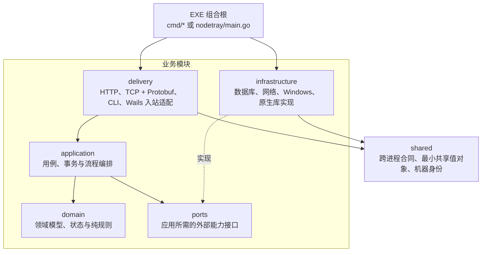

固定约束：

- `domain` 不导入数据库、网络、Windows、Wails、React、cgo 或其他外层实现。
- `application` 只依赖本模块 `domain`、`ports` 和必要的稳定共享合同。
- `delivery` 只负责输入解析、身份/协议校验、调用用例和输出映射，不承载业务规则。
- `infrastructure` 实现 `ports`；具体实现只能在 EXE 组合根装配。
- 模块间通过应用门面、端口或集成合同协作，不直接导入对方的基础设施。
- `cmd/*/main.go` 和 `nodetray/main.go` 只负责配置、依赖注入、进程生命周期和退出码。
- `internal/shared` 只保留真正跨模块稳定的内容，不成为通用工具垃圾场。

### 2.1 配置与通信统一约束

- `gui.exe`、`agent.exe`、`worker.exe`、`helper.exe`、`nodetray.exe` 都必须拥有显式的配置文件读取模块；启动顺序统一为“定位配置文件 → 读取 → 合并默认值 → 校验 → 生成只读运行快照 → 装配并启动”。
- 每个 EXE 保留自己的配置 Schema 和默认值，公用代码库只提供 `ConfigLoader`、错误模型、规范化和校验接口，不建立包含全部 EXE 字段的超级配置结构。
- EXE/进程之间的业务与控制通信统一使用 `TCP + Protobuf`；GUI↔Agent、Agent↔Worker、Agent↔Helper、NodeTray↔Agent/Helper 都遵守此约束。
- `.proto` 文件、协议版本、稳定错误码和生成代码规范放入公用代码库；TCP 传输统一使用长度前缀、连接/读写超时、最大消息限制、心跳和版本握手。
- 协议合同按用途拆分为 `centralnode.proto`、`worker.proto`、`deletion.proto` 和 `nodectl.proto`，禁止所有进程共用一个持续膨胀的单体 `.proto` 文件。
- TCP 监听地址和端口由监听方配置文件负责。Agent 为全部 Worker 绑定一个 loopback TCP 端点，绑定成功后把实际端点和唯一实例 ID 通过启动参数传给 Worker；Worker 主动回连并注册，不在自己的配置中保存固定监听端口。Helper 和本机控制面继续默认绑定 loopback，不对局域网暴露。
- 配置中的相对路径统一相对于所属配置文件目录解析；父进程启动子进程时传递规范绝对配置路径，禁止依赖当前工作目录。
- NodeTray 可以编辑 Agent、Worker、Helper 配置，但不因此获得 Worker 生命周期所有权。Worker 配置保存后标记 `needsRestart(workerPool)`，由 NodeTray 请求 Agent 排空并整体重建 Worker 池；只有全部新 Worker 完成读取、回连注册并报告生效摘要后才清除该状态。
- 同一 EXE 内部的业务模块仍通过应用门面和端口接口调用，不把进程内调用改成 TCP。
- 当前源码中的 MessagePack 和 Windows 命名管道仅作为迁移前事实保留，不属于目标架构。

目标模块根：

```text
internal/modules/
├─ central/
├─ nodeagent/
├─ mediaworker/
├─ analysis/
├─ deletion/
├─ nodemanagement/
└─ tooling/

internal/shared/
├─ contracts/
├─ protobuf/
├─ transport/
├─ configuration/
├─ identity/
├─ media/
├─ features/
├─ metrics/
└─ testkit/          # 仅供开发、测试和基准，不进入生产业务流程
```

## 3. `gui.exe` 目标架构

设计目的：作为中央控制面，连接多个 Agent，管理扫描任务，协调分析和删除，并向浏览器提供唯一生产 HTTP API；它不执行媒体计算或本地文件删除。

实现方法：中央运行时放入 `central` 模块；候选生成与复筛放入独立 `analysis` 模块；删除确认和派发使用 `deletion` 模块应用门面；PostgreSQL、Agent TCP 和内嵌 Web 均作为外层适配器。

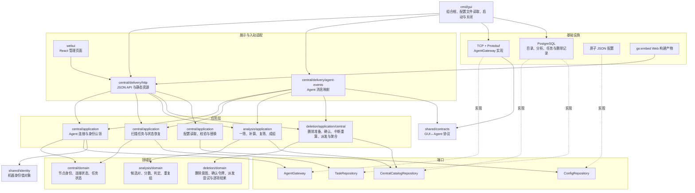

关键边界：`central` 不直接操作分析表细节；`analysis` 通过仓储端口持久化；HTTP handler 不直接执行 SQL；删除确认逻辑不放入 React。

删除执行以稳定的删除操作 ID 保存原始显式选择和已确认模式，每次向节点派发使用新的任务 ID。GUI、Agent、Helper 重启或通信中断后，不续传旧删除批次：中央端从原选择中重新计算仍存在、仍可删除且尚未完成的文件，再创建新任务 ID 派发。重新计算不得扩大选择、改变删除模式、复用旧 token 或引入分析版本判断。

## 4. `agent.exe` 目标架构

设计目的：作为媒体节点协调者，负责枚举、扫描编排、本地事实存储、Worker 生命周期、中心同步和删除转发；它不加载媒体 DLL，也不直接执行删除。

实现方法：`nodeagent` 统一承载节点用例和本地目录领域；外部能力全部通过端口接入 Everything/Walker、SQLite、Worker TCP + Protobuf、PostgreSQL、Helper TCP + Protobuf 和 Windows 指标。

```mermaid
flowchart TB
    A0["cmd/agent<br/>组合根、配置文件读取、日志、信号与优雅关闭"]

    subgraph ADLV["入站适配"]
        ATCP["nodeagent/delivery/tcp<br/>GUI TCP + Protobuf 业务协议"]
        ACTRL["nodeagent/delivery/control<br/>NodeTray TCP + Protobuf 控制协议"]
    end

    subgraph AAPP["应用层"]
        ASCAN["ScanMedia<br/>枚举、剪枝与派发"]
        AP2["ComputePhase2<br/>补算与结果提交"]
        ASYNC["SyncCatalog<br/>增量上行与重试"]
        ADEL["ForwardDeletion<br/>删除转发、中断上报与结果同步"]
        ALIFE["NodeLifecycle<br/>状态、drain 与关闭"]
    end

    subgraph ADOM["领域层"]
        ACAT["节点媒体目录<br/>MediaFile、FeatureState、SyncGeneration"]
        AJOB["扫描任务<br/>状态、进度、幂等与重连续传"]
        AROUTE["计算路由<br/>缺失字段与盘级调度规则"]
    end

    subgraph APORT["端口"]
        APENUM["MediaEnumerator"]
        APSTORE["LocalCatalogRepository"]
        APWORKER["WorkerPool"]
        APCENTER["CentralSyncGateway"]
        APHELPER["DeletionHelperGateway"]
        APMETRIC["MetricsSink"]
    end

    subgraph AINF["基础设施"]
        AIENUM["Everything SDK / Walker"]
        AISQLITE["SQLite + sync_queue"]
        AIWORKER["单一 Worker TCP 监听端点<br/>Protobuf 注册 + Worker 进程监督"]
        AIPG["PostgreSQL 同步适配器"]
        AIHELPER["Helper TCP + Protobuf 客户端"]
        AISTATS["Windows 进程与磁盘指标"]
    end

    APC["shared/contracts + protobuf<br/>GUI↔Agent、Agent↔Worker、删除与控制协议"]
    API["shared/identity<br/>机器身份"]

    A0 --> ATCP
    A0 --> ACTRL
    A0 --> AIENUM
    A0 --> AISQLITE
    A0 --> AIWORKER
    A0 --> AIPG
    A0 --> AIHELPER
    ATCP --> ASCAN
    ATCP --> AP2
    ATCP --> ADEL
    ACTRL --> ALIFE
    ASCAN --> ACAT
    ASCAN --> AJOB
    ASCAN --> AROUTE
    AP2 --> ACAT
    AP2 --> AROUTE
    ASYNC --> ACAT
    ADEL --> AJOB
    ALIFE --> AJOB
    ASCAN --> APENUM
    ASCAN --> APSTORE
    ASCAN --> APWORKER
    AP2 --> APSTORE
    AP2 --> APWORKER
    ASYNC --> APSTORE
    ASYNC --> APCENTER
    ADEL --> APHELPER
    ADEL --> APSTORE
    ALIFE --> APWORKER
    AIENUM -.->|"实现"| APENUM
    AISQLITE -.->|"实现"| APSTORE
    AIWORKER -.->|"实现"| APWORKER
    AIPG -.->|"实现"| APCENTER
    AIHELPER -.->|"实现"| APHELPER
    AISTATS -.->|"实现"| APMETRIC
    ATCP --> APC
    ACTRL --> APC
    AIWORKER --> APC
    A0 --> API
```

关键边界：Agent 是 Worker 的唯一生命周期所有者和 TCP 监听方；每个 Worker 携带 Agent 分配的实例 ID 主动回连注册，Agent 将连接映射到已启动的 Worker 进程。NodeTray 只能通过控制协议管理 Agent；删除只能经 Helper；删除链路中断时 Agent 上报中断并等待 GUI 使用新任务 ID 重新派发，不自行重放旧删除批次；本地 SQLite 是节点扫描期间的事实来源。

## 5. `worker.exe` 目标架构

设计目的：在独立进程中执行单个媒体计算任务，把 cgo、FFmpeg 和原生崩溃隔离在 Agent 之外。

实现方法：`mediaworker` 的应用层编排“打开一次、哈希、缓存查询、按缺失字段分析、漂移复核、部分结果返回”；VideoCore 只作为 `MediaEngine` 端口实现。

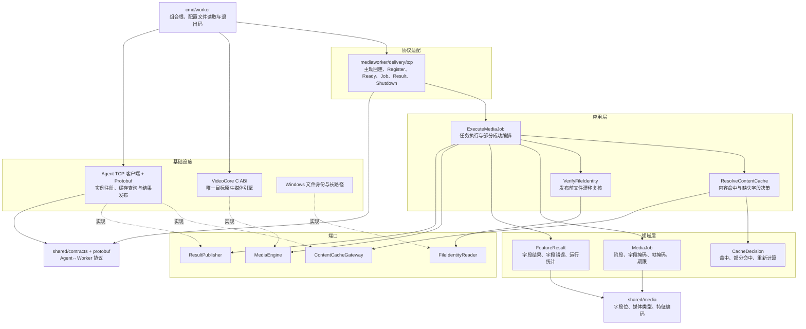

关键边界：Worker 不访问 SQLite/PostgreSQL，不提供监听端口，不管理其他 Worker；它读取自己的媒体与资源配置，再使用 Agent 启动时传入的 loopback 端点和实例 ID 主动回连注册。目标架构只保留 `videocore.dll`，`mediacore` 仅允许作为迁移期差分验证路径。

## 6. `helper.exe` 目标架构

设计目的：以最小管理员权限边界执行本机受控删除，并把失败限制在单个条目；它不决定删除清单，也不连接中央数据库。

实现方法：`deletion` 模块把删除政策和执行用例分开；loopback TCP + Protobuf、Windows 路径解析、只读属性、软删移动和单实例机制均为基础设施。

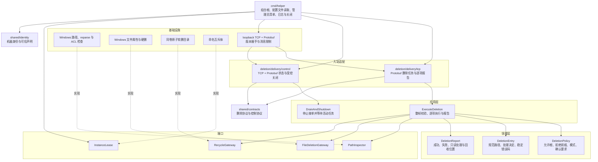

关键边界：Helper 不接受任意 shell 命令，不递归删除目录，不处理 UNC/reparse 目标，不修改 ACL/所有权；清单选择、代表文件保护、二次确认和中断后的剩余文件重算由中央端完成。Helper 不续传或重放旧删除任务，只执行 Agent 当前派发的任务 ID。

## 7. `nodetray.exe` 目标架构

设计目的：为本机操作员提供节点配置、状态和可信生命周期管理；它不执行媒体计算、删除或中央分析。

实现方法：`nodemanagement` 模块保留独立领域状态机；React/Wails 与通知区域是展示层；配置文件、TCP + Protobuf 控制客户端、进程 API、UAC、计划任务和登录启动均通过端口适配。

```mermaid
flowchart TB
    N0["nodetray/main.go<br/>配置文件读取、Wails/Win32 组合根与运行模式"]

    subgraph NDLV["展示与入站适配"]
        NWEB["nodetray/frontend<br/>React 节点控制台"]
        NWAILS["nodemanagement/delivery/wails<br/>类型化后端接口"]
        NTRAY["nodemanagement/delivery/tray<br/>通知区域菜单与通知"]
        NELEVATED["elevated-action 入站<br/>一次性受限管理员动作"]
    end

    subgraph NAPP["应用层"]
        NCONFIG["ManageConfiguration<br/>按组件加载、校验、保存与 needsRestart"]
        NLIFE["ManageComponents<br/>认领、启动、停止、重启"]
        NEXIT["ExitNodeTray<br/>普通退出与完整退出"]
        NSTART["ManageStartupPolicy<br/>登录启动与 Helper 任务"]
        NREFRESH["RefreshNodeState<br/>状态轮询、事件与注意项"]
    end

    subgraph NDOM["领域层"]
        NSTATE["ComponentLifecycle<br/>stopped、starting、running、stopping、failed"]
        NCLAIM["TrustedClaim<br/>PID、启动时间、路径、握手与指纹"]
        NCFG["ConfigurationState<br/>组件、磁盘指纹、运行指纹、needsRestart 目标"]
        NMODE["StartMode 与 HelperEnabled"]
    end

    subgraph NPORT["端口"]
        NPCONFIG["ConfigurationRepository"]
        NPCONTROL["ComponentControlGateway"]
        NPPROC["ProcessSupervisor"]
        NPELEV["ElevationGateway"]
        NPTASK["ScheduledTaskGateway"]
        NPLOGIN["LoginStartupGateway"]
        NPNOTIFY["NotificationGateway"]
    end

    subgraph NINF["基础设施"]
        NIJSON["ACL 感知原子 JSON + 备份"]
        NITCP["nodectl TCP + Protobuf 客户端"]
        NIPROC["Windows 进程创建、检查与可信终止"]
        NIUAC["一次性受限 TCP + Protobuf 提权通道"]
        NITASK["固定 Helper 计划任务"]
        NILOGIN["当前用户登录启动"]
        NIWINTRAY["Shell_NotifyIcon 与 Windows 通知"]
    end

    NC["shared/contracts<br/>本机控制协议"]
    NI["shared/identity<br/>机器身份"]

    N0 --> NWAILS
    N0 --> NTRAY
    N0 --> NELEVATED
    NWEB --> NWAILS
    NWAILS --> NCONFIG
    NWAILS --> NLIFE
    NWAILS --> NEXIT
    NWAILS --> NSTART
    NTRAY --> NLIFE
    NTRAY --> NEXIT
    NREFRESH --> NSTATE
    NLIFE --> NSTATE
    NLIFE --> NCLAIM
    NCONFIG --> NCFG
    NSTART --> NMODE
    NCONFIG --> NPCONFIG
    NLIFE --> NPCONTROL
    NLIFE --> NPPROC
    NEXIT --> NPCONTROL
    NEXIT --> NPPROC
    NSTART --> NPELEV
    NSTART --> NPTASK
    NSTART --> NPLOGIN
    NREFRESH --> NPNOTIFY
    NIJSON -.->|"实现"| NPCONFIG
    NITCP -.->|"实现"| NPCONTROL
    NIPROC -.->|"实现"| NPPROC
    NIUAC -.->|"实现"| NPELEV
    NITASK -.->|"实现"| NPTASK
    NILOGIN -.->|"实现"| NPLOGIN
    NIWINTRAY -.->|"实现"| NPNOTIFY
    NITCP --> NC
    N0 --> NI
```

关键边界：NodeTray 不直接管理单个 Worker；Worker 配置变更通过 Agent 的“排空并重建 Worker 池”用例生效。普通窗口关闭只隐藏；完整退出只操作可信认领组件并按 Helper → Agent 顺序；默认退出与完整退出必须是不同用例。

## 8. 开发与验收工具 EXE 的共同边界

六个工具统一归入 `tooling` 模块，但每个 EXE 保持独立组合根和单一用途。工具可以调用生产模块公开的应用门面或纯算法入口，不得导入生产基础设施内部细节。

### 8.1 `benchio.exe`

设计目的：只读测量指定媒体根的并行顺序读取能力，输出可重放的 IO 基线证据。

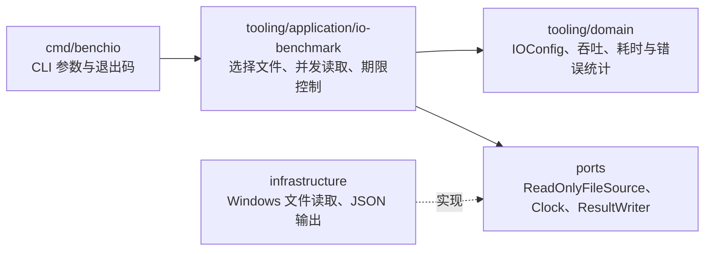

### 8.2 `benchscreen.exe`

设计目的：用确定性合成特征验证一筛候选生成的正确性、耗时和内存，不经过 HTTP 或 PostgreSQL。

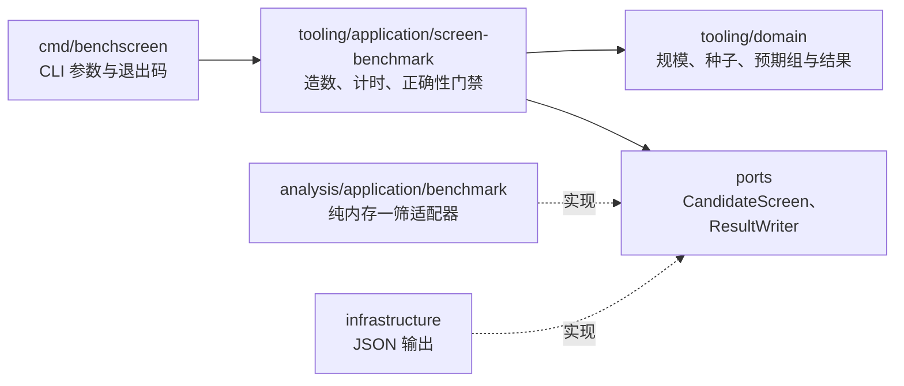

### 8.3 `benchsync.exe`

设计目的：在隔离 run ID 下测量 PostgreSQL 批量同步吞吐和幂等性，不写入生产业务表。

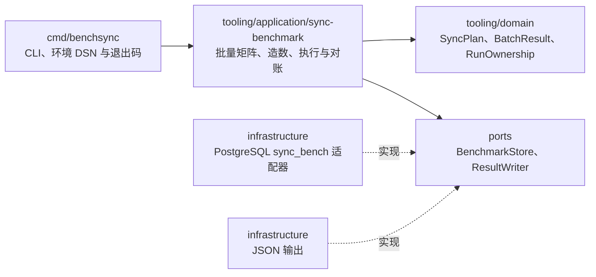

### 8.4 `corpusgen.exe`

设计目的：生成由 manifest 和 run ID 明确认领的确定性测试语料，并只清理由自己认领的文件。

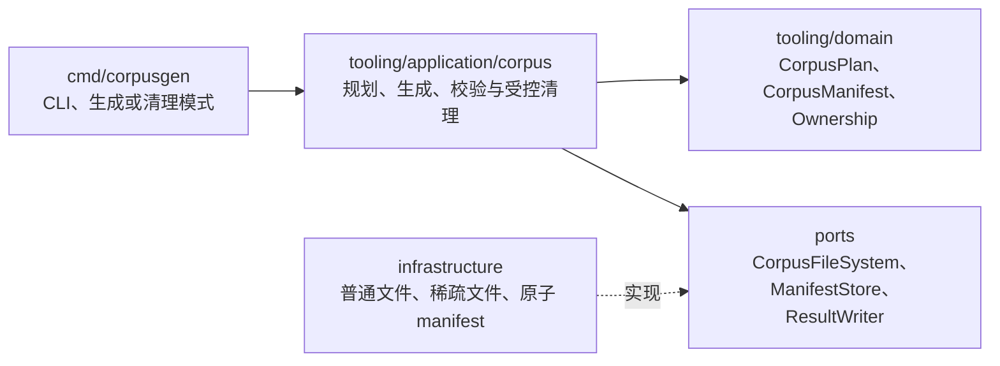

### 8.5 `perfreport.exe`

设计目的：聚合多类结构化证据，执行固定验收门禁并生成脱敏 JSON/Markdown 报告。

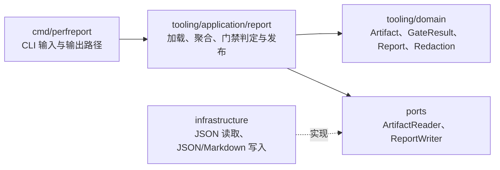

### 8.6 `soakrun.exe`

设计目的：在限定语料、期限和证据目录内编排长期子进程运行，记录退出码和证据；它不接管生产组件的内部生命周期。

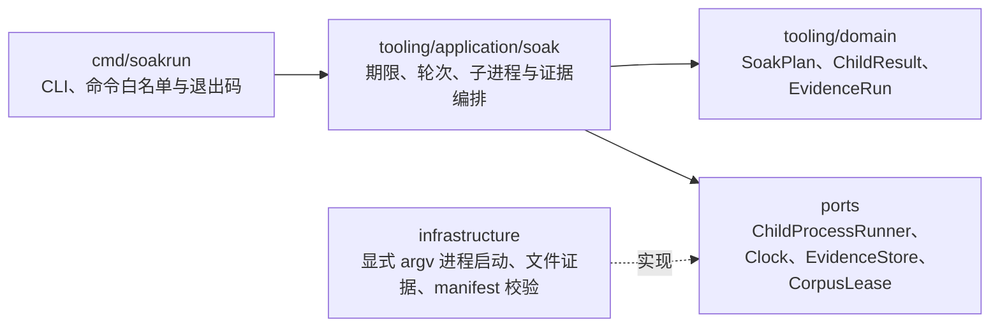

工具层共同约束：

- 工具 EXE 不被任何生产模块导入。
- destructive 清理必须有 manifest、run ID 和目标根三重匹配。
- DSN 只从环境或显式安全配置进入，不写入证据。
- 报告生成与基准执行分离，避免报告代码反向依赖生产运行时。
- `benchscreen` 只能使用分析模块公开的纯算法门面，不能复制一份一筛算法。

## 9. EXE 间目标关系

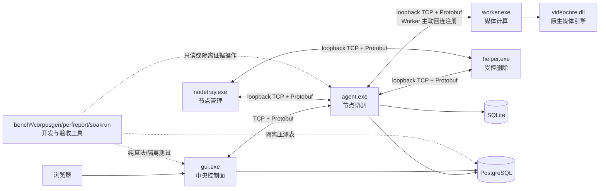

目标所有权：

- NodeTray 管理 Agent/Helper，Agent 管理 Worker。
- GUI 负责中央任务与用户确认，不拥有节点进程生命周期。
- Agent 拥有节点 SQLite 和 Worker 调度；Worker 只拥有当前媒体 session。
- Helper 只拥有当前删除请求的本机执行过程。
- PostgreSQL 是中央分析事实来源，SQLite 是节点扫描期间事实来源。
- 工具 EXE 不成为生产调用链的一部分。

## 10. 后续迁移原则

1. 先建立目标目录与依赖门禁，不同时改业务语义。
2. 从纯领域模型和端口接口开始，再迁移应用用例，最后迁移基础设施和入口组装。
3. 每次只迁移一个可执行项目的一条完整纵向调用链，保留适配层兼容旧 import。
4. 生产入口迁移完成且相关回归通过后，才删除旧包。
5. `mediacore` 只在 VideoCore 差分验证完成前保留；目标结构不允许新代码依赖它。
6. 每个目标模块建立局部 `AGENTS.md`，记录设计目的、实现方法、允许依赖、禁止依赖、入口和验证命令。
7. 根级 `AGENTS.md` 只保留全仓地图、全局依赖方向、跨模块合同和文档索引，避免超过 Codex 默认项目说明大小限制。
