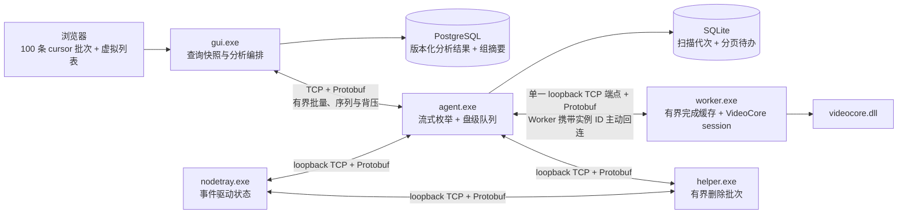

# mySingerServer 性能优化方案

日期：2026-08-09
状态：目标方案，待按阶段实施与实机验证
事实来源：当前仓库源码、现有 M6 调优与验收文档、目标分层架构文档

## 1. 文档目的

本方案用于指导 `gui.exe`、`agent.exe`、`worker.exe`、`helper.exe`、`nodetray.exe` 及公用代码库的后续性能优化。方案不重新设计业务流程，而是在现有分层架构、进程所有权和数据语义下，降低内存峰值、减少无效计算与数据库重复聚合，并提高大规模扫描、分析、浏览和同步的稳定吞吐。

本方案遵循以下边界：

- 不修改 SHA-512、PDQ、pHash、Sobel、六帧视频复筛等算法语义和阈值。
- 不改变 GUI 管理中央任务、Agent 管理 Worker、NodeTray 管理 Agent/Helper 的生命周期所有权。
- Agent 为全部 Worker 监听一个 loopback TCP 端点；每个 Worker 携带 Agent 分配的实例 ID 主动回连注册，不为每个 Worker 配置固定监听端口。
- 不为了性能把媒体 DLL 加载回 Agent，也不让 Worker 直接访问 SQLite/PostgreSQL。
- 删除流程仍由 GUI 确认、Agent 转发、Helper 执行；重启或中断后不续传旧删除批次，而是从原显式选择重新计算仍需删除的文件并使用新任务 ID 派发。性能优化不得弱化逐项结果和可恢复语义。
- 公用模块仍是代码库，不建立独立业务分层；只沉淀配置、Protobuf、传输、指标和媒体类型等复用代码。
- 模块间目标通信方式按已确认架构统一为 TCP+Protobuf。本方案会明确区分“当前源码”和“目标实现”，不把尚未完成的协议迁移写成现状。
- `gui.exe`、`agent.exe`、`worker.exe`、`helper.exe`、`nodetray.exe` 分别读取自己的配置文件；性能参数由实际使用它的 EXE 持有，不依赖其他进程通过环境变量隐式注入。
- 不为性能方案新增独立的安全、权限或审计模块；必要约束保留在配置校验、任务状态和删除执行等既有模块中。

## 2. 参考资料

- `docs/current-project-architecture.md`
- `docs/executable-target-layered-architecture.drawio`
- `docs/superpowers/specs/2026-08-08-executable-target-layered-architecture-design.md`
- `docs/superpowers/specs/2026-08-09-web-interaction-operation-design.md`
- `docs/details/M6-tuning.md`
- `docs/superpowers/specs/2026-07-29-m6-tuning-design.md`
- `docs/acceptance/2026-07-29-m6.md`
- `docs/superpowers/specs/2026-07-31-v4-million-scale-web-redesign-design.md`

## 3. 当前性能基线

### 3.1 已有实测结果

现有 M6 已完成性能工具和大规模验证，不需要重新建设一套压测体系。当前可作为回归基线的结果如下：

| 场景 | 当前结果 | 使用方式 |
|---|---:|---|
| 百万行一筛 | 1,000,000 行，25,000 组，总耗时 810 ms | 后续优化不得降低正确性，耗时与内存同时比较 |
| 百万行一筛内存 | 峰值 Heap 478,478,224 B | 作为一筛内存收敛的主要基线 |
| PostgreSQL 百万行同步 | 约 94,244～115,366 行/秒 | 比较批量大小、事务时间和数据库压力 |
| SSD 只读基准 I 盘 | 365.355 MiB/s | 比较相同目录、流数和块大小 |
| SSD 只读基准 H 盘 | 867.957 MiB/s | 比较相同目录、流数和块大小 |
| 长时间运行 | 21 小时 38 分 57.880 秒 | 作为资源增长和稳定性回归参考 |

已有结果的边界也必须保留：最终长测没有单独证明 HDD 利用率达到 80%，也没有单独证明 CPU 利用率达到 85%；21 小时 38 分的运行由项目所有者接受，但不是原定 24 小时自然完成。因此后续方案不能把这两项写成既有 PASS。

### 3.2 当前源码已有的优化机制

| 区域 | 当前实现 | 源码位置 |
|---|---|---|
| Agent 指标 | 采集 CPU、RSS、Heap、句柄、goroutine、Worker、磁盘、待处理字节和 P95 延迟；历史快照最多 300 秒 | `internal/stats/collector.go`、`internal/stats/histogram.go` |
| 性能分析 | pprof 可选启用，且只允许回环地址 | `internal/stats/pprof.go`、`internal/config/agent.go` |
| 扫描背压 | 使用加权信号量按文件字节限制在途工作量 | `internal/agent/limiter.go` |
| 盘级调度 | HDD/SSD 分别使用配置的每盘流数，文件按磁盘和路径顺序处理 | `internal/agent/scan.go`、`internal/store/files.go` |
| 枚举和结果批量 | 枚举 10,000 条一批写 SQLite；SHA 结果 512 条或 200 ms 刷新；媒体结果 512 条或 200 ms 上报 | `internal/agent/scan.go` |
| Worker 池 | 默认 Worker 数等于逻辑 CPU 数；任务队列 1,024；空闲 Worker 驱动派发；崩溃后监督补位 | `internal/config/agent.go`、`internal/worker/pool.go`、`internal/worker/supervisor.go` |
| 内容复用 | 按 SHA、媒体类型、字段掩码和帧掩码合并并发计算 | `internal/worker/deduper.go` |
| 媒体处理 | 生产路径使用一次打开的 VideoCore session 完成哈希和缺失字段分析；联系表落本地缓存 | `internal/wproc/run.go`、`internal/wproc/pipeline_session.go` |
| SQLite | WAL、`synchronous=NORMAL`、5 秒 busy timeout；单连接串行写入 | `internal/store/db.go` |
| PostgreSQL 同步 | 单次远端批量最大 5,000 行，使用 `pgx.Batch` 和本地 generation 对账 | `internal/syncer/syncer.go` |
| 一筛 | PostgreSQL 使用 keyset 分页读取；PDQ 使用四段 band 倒排；写入成员时使用 `CopyFrom` | `internal/firstscreen/store.go`、`internal/firstscreen/bandindex.go` |
| Web 大数据浏览 | 重复组每页固定 100 条、虚拟列表、每个查询保存最近 5 页、300 ms 搜索防抖、取消过期请求 | `webui/src/hooks/usePagedGroups.ts`、`webui/src/components/VirtualTable.tsx`、`webui/src/features/groups/GroupsPage.tsx` |
| Web 状态刷新 | 前台 2 秒、后台 10 秒，终态停止，禁止并发重复轮询 | `webui/src/hooks/usePolling.ts` |
| Helper | 每帧最多 2,000 条，逐项执行并形成逐项报告 | `internal/helper/delete.go`、`internal/helper/server.go` |
| NodeTray | 首次读取快照，后续主要使用组件状态、操作进度和注意事项事件更新 | `nodetray/frontend/src/state/nodeStore.ts` |

## 4. 当前主要性能风险

以下内容是由源码结构直接识别出的优化候选，除已存在压测数据外，不把它们表述为已经通过 profile 证明的瓶颈。

### 4.1 Agent 扫描存在全量内存放大

`ScanManager.run` 在枚举阶段维护全量 `seen` 路径集合；随后 `PendingSnapshot` 将当前机器全部待处理文件读入 `map[int64][]PendingFile`，`preparePending` 又建立同规模工作集合和路由信息。百万文件时，路径字符串、map、切片和 Job 对象会同时驻留，内存上界不再只由 `pending_bytes_mb` 控制。

`pending_bytes_mb` 当前限制的是已经进入处理函数的文件总字节权重，不限制枚举快照、路径集合、Job 对象和协议结果缓冲。因此它不能单独保证 Agent 的总体内存上限。

### 4.2 Worker 完成结果缓存可能随任务规模增长

`internal/worker/deduper.go` 的 `computed` map 按任务保留已经完成的 SHA 查询结果，直到 `EndTask` 才整体清除。该机制能让同一扫描中的重复内容复用计算结果，但在大量唯一媒体文件的任务中，也可能累积大量没有后续复用价值的条目。

优化方向不是删除 single-flight，而是把“正在计算的 flight”和“完成后的短时复用缓存”分开：flight 必须保留，完成缓存必须有容量和时间上限。

### 4.3 一筛读取已分页，但计算仍整体驻留

`LoadImageFeatures`、`LoadVideoFeatures` 使用 SHA keyset 分页从 PostgreSQL 读取，这是正确基础；但读取结果最终仍追加到完整切片。`Analyzer.Run` 同时持有图片特征、视频特征、候选对和精确组，`ReplaceResults` 又构建全部 group/member 中间结构，并把全部成员放入 `[][]any` 后一次 `CopyFrom`。

当前百万行性能已经很好，优先目标不是降低 810 ms，而是降低约 478 MB 的 Heap 峰值并保证 5～10 倍规模时不会发生内存突增。

### 4.4 重复组 API 每次重复聚合全量数据

`internal/gui/groups.go` 的列表请求会：

1. 连接 `dup_groups`、`dup_members`、`files`；
2. 对当前类型全部存活成员重新统计数量、总大小、浪费大小和机器集合；
3. 再执行一次总数统计；
4. 使用 `LIMIT/OFFSET` 获取页面。

该实现保证结果实时一致，但在重复组数量扩大后会出现三个风险：每次请求重复聚合、路径子串搜索无法使用普通 B-tree、深页 OFFSET 扫描成本随页码增长。

### 4.5 Phase2 构建快照仍为全量内存模型

`internal/phase2/postgres.go` 会把候选组、规范化 pair、SHA 集合、文件副本和特征状态加载到内存，再按 `task_shard_size` 派发。任务分片只控制发往 Agent 的单帧大小，不能限制构建快照阶段的内存峰值。

### 4.6 配置项存在“可配置但未进入运行路径”的情况

当前源码中：

- `pipeline.read_chunk_kb` 能被 Agent 配置读取和 NodeTray 编辑，但 `AgentConfig.WorkerEnv()` 没有把它传给 Worker；
- `internal/wproc/config.go` 将 Worker 读取块固定为 4,096 KiB；
- `scan.hdd_read_block_mb`、`scan.image_mem_resident_mb`、`scan.image_timeout_s`、`scan.video_timeout_s` 没有进入当前生产扫描/Worker 运行路径；
- 真正生效的内存和超时值来自 `worker.image_memory_mb`、`worker.image_timeout_s`、`worker.video_timeout_s`。

在修复配置所有权前，围绕这些失效配置做调参不会得到真实结果。这是性能优化的首要前置任务。目标实现不再由 Agent 通过环境变量拼装完整 Worker 性能配置，而是由 `worker.exe` 自己读取 Worker 配置文件；Agent 只持有 Worker 数量、可执行文件路径、Worker 配置文件路径和进程监督参数。

### 4.7 当前传输实现与目标架构不同

截至本文日期，当前源码仍是：

- GUI↔Agent：长度前缀 TCP + MessagePack；
- Agent↔Worker：命名管道 + MessagePack；
- Agent↔Helper：命名管道 + MessagePack；
- NodeTray 控制和提权通道仍有命名管道实现。

目标架构已经确认改为 TCP+Protobuf。因此传输性能优化必须在 Protobuf 合同和 TCP 生命周期稳定后重新建立基线，不能直接把当前 MessagePack/命名管道的数字当成目标协议结果。

## 5. 性能目标

所有指标都必须在相同硬件、相同语料、相同配置和相同数据库快照下与基线比较。

| 编号 | 指标 | 目标 |
|---|---|---|
| PERF-01 | 扫描吞吐 | IO 受限场景达到对应磁盘 `benchio` 基线的 80% 以上；计算受限场景 Agent+Worker CPU 平均利用率达到 85% 以上 |
| PERF-02 | Agent 内存 | 百万文件扫描不再因路径/Job 全量快照产生与文件数线性叠加的多份副本；稳态 8 小时内 RSS 无持续单调增长 |
| PERF-03 | Worker 缓存 | 完成结果缓存有明确容量和 TTL；唯一文件数量增长不再导致任务结束前缓存无限增长 |
| PERF-04 | 一筛 | 保持百万行正确性和约 1 秒级耗时；百万行峰值 Heap 目标不高于 400 MiB；更大规模按近似线性趋势增长 |
| PERF-05 | 重复组查询 | 一千万文件数据集下，常用首屏查询 P95 ≤500 ms，路径搜索 P95 ≤1 s，深页不使用 OFFSET |
| PERF-06 | 数据库同步 | 保持生产事务上限 5,000 行；吞吐不低于现有百万行基线的 95%；重试不丢不重 |
| PERF-07 | TCP+Protobuf | 业务批量推荐负载不超过 1 MiB，绝对帧上限 16 MiB；控制消息不会被大型结果帧长期阻塞；断线后按链路合同续传、重新排队或重新计算删除文件 |
| PERF-08 | Web | 重复组和成员 DOM 数量保持有界；搜索只触发防抖后的有效请求；后台页面网络频率不高于当前 10 秒一次 |
| PERF-09 | Helper | 2,000 条删除请求的协议和校验内存有界；默认保持逐项串行文件操作，不为追求吞吐制造同盘随机 IO |
| PERF-10 | NodeTray | 空闲时保持事件驱动；不新增高频全量轮询，连续事件更新合并后不造成明显 UI 抖动 |

其中 PERF-01 的 HDD 和 CPU 指标属于待补实机验证项，不能因文档设定目标而提前标记为通过。

## 6. 目标性能数据流



## 7. 分阶段优化方案

### 7.1 P0：建立可复现基线并修正配置链

这一阶段不改变业务算法，优先消除“配置看似生效但运行未使用”的问题。

#### 7.1.1 配置收敛

- 为 `worker.exe` 建立独立配置文件读取模块，把 `read_chunk_kb`、`image_memory_mb`、媒体超时、联系表缓存和 TCP+Protobuf 帧限制放入 Worker 配置，由 `wproc.Config` 直接接收读取结果。Worker 配置不保存监听端口。
- Agent 配置保留 Worker 池规模、`worker.exe` 路径、Worker 配置文件路径、单一 Worker loopback 监听地址、启动/注册/补位超时和任务队列参数。Agent 先绑定监听端点，再为每个 Worker 生成唯一实例 ID，并把实际端点、实例 ID 和绝对 Worker 配置路径作为启动参数传入；不再逐项注入 `WPROC_*` 性能环境变量。
- 将 `scan.hdd_read_block_mb` 标记为废弃并从 NodeTray 高级配置中隐藏；读取块大小统一归 Worker 配置，不能继续保留两个表示相同目的但只有一个生效的字段。
- 将 `scan.image_mem_resident_mb`、`scan.image_timeout_s`、`scan.video_timeout_s` 兼容迁移到 Worker 配置后删除，最终只保留一组权威字段。
- GUI、Agent、Worker、Helper、NodeTray 的配置加载都输出配置版本和最终生效摘要；日志只记录非敏感字段名和数值。每次扫描开始记录生效的 Worker 数、盘流数、块大小和背压上限。
- 公用 `configuration` 代码库只复用原子读取、默认值合并和错误格式，不持有全局配置，也不替任何 EXE 决定业务默认值。

#### 7.1.2 指标补充

在现有 `internal/stats` 基础上增加：

- 枚举耗时、SQLite 枚举批次耗时和 P95；
- 待处理文件数、待处理 Job 对象数、Worker 队列等待 P50/P95/P99；
- TCP+Protobuf 编码、写入、读取、解码耗时和字节数；
- SQLite/PostgreSQL 每类查询耗时、返回行数和错误数；
- single-flight 等待数、完成缓存当前条目数、命中数和淘汰数；
- 联系表缓存命中、缺失、损坏、发布等待和清理数量；
- Go GC pause、GC 次数和内存限制值。

指标写入继续使用有界历史和轮转 JSONL，采集开销门槛保持低于 1% CPU。

#### 7.1.3 基线矩阵

每次优化必须至少比较：

- HDD 1/2 流，SSD 4/6/8 流；
- Worker 数 `CPU/2`、`CPU`、`CPU+25%`；
- 读取块 1/2/4 MiB；
- `pending_bytes_mb` 512/1024/2048；
- 图片、视频、混合媒体三种语料；
- 10 万、100 万和条件允许时 500 万规模。

不允许一次提交同时调整多个参数又不保留单变量对照结果。

### 7.2 P1：Agent 扫描改为流式有界管线

#### 7.2.1 用扫描代次替换全量 `seen` 集合

在本地 SQLite 为文件记录引入扫描代次，例如 `scan_generation`：

1. 扫描开始时生成单调代次；
2. 枚举批量 upsert 时写入本代次；
3. 枚举结束后只分页查询本代次且仍有缺失字段的记录；
4. 扫描成功完成后再处理未出现在本代次的历史记录。

这样可以删除进程内的全量 `seen map`，同时保留“只处理本轮实际看见文件”的语义。

#### 7.2.2 分页生产盘级任务

将 `PendingSnapshot` 的全量返回改成按 `(disk_no, path)` keyset 分页：

- SQLite 查询每次读取 2,000～10,000 条；
- 每块盘建立有界输入队列；
- HDD/SSD 并发流从队列消费；
- 任务对象只在进入有界队列时创建；
- byte limiter 继续限制实际处理中数据，但新增 Job 数量上限防止大量小文件绕过字节限制。

建议同时设置两个背压维度：

```text
允许派发 = pending_bytes < byte_limit
        且 pending_jobs < job_limit
```

`pending_jobs` 初始建议为 `max(worker_count × 8, 1024)`，最终值以队列等待和内存曲线确定。

#### 7.2.3 SQLite 索引与写入

在实际 `EXPLAIN QUERY PLAN` 结果支持后，考虑增加：

- 本代次待办的 `(machine_id, scan_generation, disk_no, path)` 组合索引；
- `sync_queue` 未同步项的 partial/composite 索引，覆盖 `table_name、enqueued_at、row_pk`；
- 保持单写连接，不盲目增加 SQLite 连接数；读取并发应通过短事务和分页实现。

枚举 10,000 条、结果 512 条/200 ms 是当前可靠基线。后续可配置化，但默认值只有在实测优于现状时才修改。

### 7.3 P1：Worker 池和媒体流水线内存收敛

#### 7.3.1 完成缓存改为有界短时缓存

`Deduper` 调整为：

- `flights`：只保存正在计算的条目，不设固定数量上限，但受 Worker/队列背压自然限制；
- `completed`：只用于解决“结果刚完成、重复请求紧接到达”的竞态；
- 默认上限建议 10,000 条、TTL 30～120 秒；
- 若条目没有等待者，可在结果持久化后直接淘汰；
- 任务结束仍执行清理，但不再依赖任务结束作为唯一内存释放点。

持久化 SQLite 是跨时间缓存，进程内完成缓存不复制其职责。

#### 7.3.2 保持单次打开的 VideoCore session

生产 `processMediaWithDeps` 已经通过一次 session 完成 Hash、缓存查询和缺失字段分析，这是应保留的主路径。优化时：

- 不恢复“先完整读一次、再让 FFmpeg/VideoCore 重新打开”的双读路径；
- 完成 VideoCore 差分验证后移除生产不可达的 legacy 媒体路径，减少二进制体积和维护分支；
- 为 open、hash、cache query、analyze、publish 分别记录 P95，而不是只记录 read/decode 两段。

#### 7.3.3 缓冲区复用

- 每个 Worker 复用自己的读取缓冲，避免跨 Worker 全局大池造成内存滞留。
- 如使用 `sync.Pool`，只接收固定大小等级且不超过 4 MiB 的缓冲；超大临时对象直接释放。
- 图片驻留缓冲仍受 `worker.image_memory_mb` 控制，不能因为复用突破 256 MiB 硬上限。
- 联系表发布目前存在进程级串行锁；改为按 SHA 分片锁或固定数量的锁分片，使不同内容可并行发布，同一 SHA 仍保持单写。
- 为联系表缓存增加总容量、最近访问时间和后台清理策略，清理不得运行在媒体任务关键路径。

#### 7.3.4 Worker 数量选择

`worker.count=0` 当前表示逻辑 CPU 数。保留此默认语义，但提供调优建议：

- 图片计算密集：从逻辑 CPU 数开始；
- 视频/大图内存受限：同时满足 `worker_count × image_memory_mb` 的内存预算；
- SSD 吞吐已满而 CPU 较低：先检查 native/数据库等待，不直接无限增加 Worker；
- HDD 场景以每盘流数为主，Worker 数不得迫使同一 HDD 产生大量随机访问。

### 7.4 P1：TCP+Protobuf 的有界批量和背压

目标传输层继续使用持久 TCP 连接和长度前缀帧，不引入 gRPC。公用代码库提供统一的 `transport` 和生成的 `protobuf` 合同。

#### 7.4.1 帧策略

- 绝对帧上限保留 16 MiB，业务默认批量目标 256 KiB～1 MiB；
- 扫描结果初始沿用“最多 512 项或 200 ms 刷新”，同时增加“达到目标字节数立即刷新”；
- 心跳、Stop、状态查询等控制消息优先于批量结果发送；
- writer 只能在帧边界重新选择高优先级队列，不能宣称控制消息可以越过已经开始写入的 TCP 帧；业务帧应保持在推荐目标内，16 MiB 只作为拒绝异常输入的绝对上限；
- 发送队列同时限制消息数和总字节数；队列满时让生产者等待，不丢弃业务结果；
- 需要连续传输的批次包含任务 ID、递增序列号和最后确认序列；是否续传由具体链路合同决定，不能把同一套通用重放语义强加给所有 EXE；
- Protobuf `bytes` 字段直接承载二进制特征，避免当前部分路径中十六进制字符串造成 2 倍体积。

#### 7.4.2 连接策略

- GUI↔Agent 使用一条长期业务连接。Agent 监听一个 Worker loopback 端点，多个 Worker 分别建立长期回连并先发送 `Register(instance_id)`；Agent↔Helper、NodeTray↔组件也使用长期连接；
- 控制消息因大结果帧发生明显头阻塞时，优先缩小业务帧；只有实测仍不满足控制延迟才拆分控制/数据连接；
- loopback 和局域网分别压测，不能用 loopback 数字替代真实局域网结果；
- 默认不启用压缩。只有路径和 JSON 类负载占主导且 CPU 有余量时，再评估按消息类型启用压缩。

#### 7.4.3 分链路恢复语义

| 链路 | 普通断线 | 进程重启或实例丢失 | 状态所有者 |
|---|---|---|---|
| GUI↔Agent | 目录同步等可连续批次从已确认序列继续；重复序列按任务 ID 幂等忽略 | Agent 从 SQLite `sync_queue` 和当前任务事实重新构建待发送批次，不依赖旧连接内存 | Agent SQLite 保存待同步事实；GUI/PostgreSQL 保存中央任务状态和已接收结果 |
| Agent↔Worker | 连接断开即使当前 Job 失败，本连接不回放旧帧 | Agent 回收旧实例连接，根据 SQLite 待办和当前任务重新排队计算；新 Worker 使用新实例 ID 注册 | Agent WorkerPool 和节点 SQLite；Worker 只拥有当前媒体 session |
| Agent↔Helper | 中断后停止继续发送旧删除批次，并上报派发中断 | GUI 从原始显式选择重新计算仍存在、仍可删除且尚未完成的文件，生成新任务 ID，经 Agent 重新派发 | GUI/PostgreSQL 保存删除操作及尝试记录；Helper 只保存当前请求执行状态 |
| NodeTray↔Agent/Helper | 重新查询组件状态，不盲目重发 Stop/Restart | 根据最新组件状态重新发起用户动作 | NodeTray 生命周期状态机 |

删除重新计算不得扩大原始显式选择，不改变已确认的软删/硬删模式，不复用旧确认 token、旧任务 ID 或旧消息序列。已经删除、已不存在或重新核对后不再符合条件的文件不再派发。该恢复规则只依据当前文件和删除记录事实，不引入分析版本判断。

#### 7.4.4 迁移验收

对相同任务同时记录旧实现和 TCP+Protobuf 实现的：

- 编解码 CPU 时间；
- 传输字节；
- 批量 P50/P95；
- 控制消息 P95；
- 断线恢复耗时；
- Worker 多实例注册成功率、重复实例 ID 拒绝结果和旧实例连接回收耗时；
- 删除中断后的重新核对数量、新任务派发数量以及已完成文件的重复派发数量；
- Agent/Worker RSS。

协议迁移通过标准是业务结果逐字段一致，性能不低于旧基线 95%，且不存在无界发送队列。

### 7.5 P2：一筛和 Phase2 改为有界内存计算

#### 7.5.1 一筛紧凑数据结构

- 图片/视频特征使用结构分离数组或紧凑结构，避免每个元素重复 Go 对象头和切片头；
- SHA 使用固定 `[64]byte`，PDQ 使用 `[4]uint64`，索引继续使用 `uint32`；
- band bucket 预估容量并按页追加，避免频繁扩容；
- 候选 pair 采用分块消费者，不把所有 pair 同时保留到 `Analyzer.Run` 结束；
- 精确组继续保持流式 SHA 顺序归并。

#### 7.5.2 结果版本化发布

当前 `ReplaceResults` 在一个事务中删除旧结果并重建全部结果。目标改为：

1. 为本次分析创建 `analysis_run_id`；
2. 分批写入 staging 或带版本字段的新结果；
3. `CopyFrom` 使用流式 source，不构建完整 `[][]any`；
4. 完成后用一个短事务切换当前版本；
5. 旧版本异步清理。

这样可减少大事务时间、避免 `allMembers` 全量驻留，并保证 Web 查询始终看到一个完整版本。

`analysis_run_id` 在本方案中只用于结果的完整发布、查询快照和旧结果清理；不扩展为 Phase2 或删除任务的跨版本协调机制。任务恢复和删除重新派发都以当前文件事实为准，本阶段不处理跨版本任务兼容问题。

#### 7.5.3 移除关键路径强制 GC

`Analyzer.Run` 当前结束时调用 `runtime.GC()` 后读取 Heap。强制 GC 时间没有单独作为阶段展示，却会增加任务完成尾延迟。优化方式：

- 使用 `runtime/metrics` 或普通 `ReadMemStats` 采集，不在请求完成关键路径强制 GC；
- 如需稳定测量，把 GC 时间单列为 `cleanup_ms` 并只在基准模式启用；
- 生产使用合理的 `GOMEMLIMIT`，而不是每轮分析强制回收。

#### 7.5.4 Phase2 分页构建和即时分片

- 按 group ID keyset 分页读取候选组；
- 在单页内规范化 pair、加载所需 SHA 特征并立即形成机器分片；
- 分片写入任务表后释放本页数据；
- 保留稳定 Task ID 和任务恢复语义；
- 对同一 SHA 的副本信息使用本轮有界 LRU，避免跨页重复查询但不保留全量副本。

### 7.6 P2：PostgreSQL 查询模型优化

#### 7.6.1 重复组摘要

为 Web 主查询维护可直接读取的组摘要，至少包含：

- 存活成员数；
- 总大小；
- 可回收大小；
- 当前代表文件；
- 机器集合或机器数量；
- 当前分析版本。

摘要在一筛/复筛版本发布时批量生成，删除成功后增量修正。HTTP handler 不再在每次列表请求中对所有成员重新聚合。

#### 7.6.2 游标分页

`/api/groups` 从 `page + size` 逐步升级为不透明 cursor：

- `members_desc` 使用 `(live_member_count, id)`；
- `newest` 使用 `(created_at, id)`；
- `reclaim_desc` 使用 `(wasted_bytes, id)`；
- API 兼容期继续接受浅页 `page`，但新 Web 只使用 cursor；
- cursor 必须绑定筛选条件和分析版本，避免翻页过程中数据漂移。

#### 7.6.3 路径搜索

当前 `strpos(lower(path), lower(q))` 无法利用普通 B-tree。优化顺序：

1. 先收集实际搜索长度和命中率；
2. 若子串搜索是主要需求，启用 `pg_trgm` 并建立 `lower(path)` GIN/GiST 索引；
3. 若多数用户按路径前缀搜索，优先改为规范化前缀索引；
4. 所有索引变更必须记录写入放大和索引体积。

#### 7.6.4 查询验收

每条优化 SQL 保存 `EXPLAIN (ANALYZE, BUFFERS)`，覆盖：

- 无筛选首屏；
- 单机器；
- 路径搜索；
- 最小成员数；
- 三种排序；
- 删除后代表文件变化；
- 10 个并发浏览会话。

### 7.7 P2：Web 请求和渲染优化

现有 100 条批次、虚拟化、防抖、AbortController 和前后台差异轮询全部保留；数字页缓存改为最多 5 个 cursor 批次的 LRU。

新增优化：

- 列表读取成功后空闲预取下一 cursor 批次，但缓存仍限制为每个查询 5 个批次；
- 缓存 key 加入分析版本，版本变化时整体失效；
- 组详情只刷新变化的成员页，不因任务进度更新重载整个组列表；
- 总览所需 Agent、任务、分析状态可由 GUI 后端提供 1 秒内存快照，避免多个浏览器重复触发相同数据库查询；
- React 行组件使用稳定 key 和必要的 memo，禁止在每次轮询中重新创建全部行模型；
- 继续在页面失焦时降频，终态停止；不为性能引入额外常驻 WebSocket，除非多客户端轮询已被实测为主要负载。

### 7.8 P3：Helper 与 NodeTray 的低风险优化

#### Helper

- 删除请求中的重复路径检测由切片两两比较改为规范化键 map，将校验从 O(n²) 降为平均 O(n)；
- 逐项文件操作默认串行，避免在同盘制造随机 IO；
- 若跨卷删除成为明确瓶颈，可按卷分组并限制为每卷 1 个执行流，总并发不超过 2～4；
- 报告按既有 2,000 条上限返回，不增加全量任务驻留。

#### NodeTray

- 保持“初始快照 + Wails 事件”的事件驱动方式；
- 100～200 ms 内连续状态事件可合并一次渲染，但操作终态必须立即发布；
- 仅在窗口可见或操作进行中主动刷新详细 Worker 状态；
- 不在 NodeTray 内采集媒体级性能数据，展示 Agent 已聚合的快照即可。

## 8. 公用代码库的性能职责

公用代码库只提供复用实现和统一接口，不形成独立服务或业务层。

| 公用模块 | 性能职责 |
|---|---|
| `configuration` | 配置默认值、范围、废弃字段迁移和最终生效值模型 |
| `protobuf` | 生成的消息类型、字段掩码、任务序列和兼容版本 |
| `transport` | TCP 帧、读写期限、有界发送队列、批量器、序列确认和连接指标 |
| `metrics` | 直方图、计数器、快照结构和 JSONL 输出接口 |
| `media` / `features` | 固定长度特征类型，减少跨模块字符串/切片转换 |
| `testkit` | 确定性语料、协议回放、故障注入和基准 fixture |

业务模块不得直接依赖公用模块内部缓存策略；缓存容量和生命周期由各 EXE 的组合根配置。

这些公用模块只是可链接代码和生成类型，不作为独立进程、远程服务或新的安全/权限层。

## 9. 配置建议

### 9.1 各 EXE 的性能配置所有权

| EXE | 独立配置文件中的性能职责 | 不应持有的配置 |
|---|---|---|
| `gui.exe` | HTTP、PostgreSQL 连接池、查询超时、一筛分页/批量、Phase2 分片和 Web 快照缓存 | Worker 媒体内存、Helper 删除批次、NodeTray 刷新参数 |
| `agent.exe` | 磁盘流数、Worker 池规模、单一 Worker TCP 监听、在途字节/任务数、结果批量、同步周期和同步批次 | Worker 内部读取块、媒体缓存目录、GUI 查询参数 |
| `worker.exe` | TCP 帧与回连超时、读取块、图片内存、VideoCore 超时、联系表缓存、完成帧大小 | 固定监听端口、Agent 扫描根、PostgreSQL、其他 Worker 状态 |
| `helper.exe` | TCP 监听、每批条目数、删除模式、逐项执行和报告超时 | 扫描调度、媒体算法、数据库连接 |
| `nodetray.exe` | 本机组件路径、各组件配置路径、启动方式、状态刷新和事件合并 | 媒体计算、中央查询和数据库参数 |

配置关系遵循“编辑者可以是 NodeTray，读取者始终是目标 EXE”：即使 NodeTray 帮助保存 Agent、Worker 或 Helper 配置，进程启动时仍由对应 EXE 自己读取和校验文件。Web 只编辑 `gui.exe` 配置。

Worker 配置的保存与生效遵循固定闭环：

1. NodeTray 原子写入并校验 `worker.json`；
2. NodeTray 把 `needsRestart(workerPool)` 记录到组件级配置状态；
3. 用户应用配置时，NodeTray 通过 Agent 控制协议请求排空并重建 Worker 池，不直接启动、停止单个 Worker；
4. Agent 先绑定单一 Worker TCP 端点，再启动 Worker，并传入实际端点、唯一实例 ID 和绝对 Worker 配置路径；
5. Worker 自行读取配置、主动回连注册并返回生效摘要；
6. Agent 汇总全部 Worker 的配置指纹和注册状态后，NodeTray 才清除 `needsRestart(workerPool)`。

所有相对路径统一相对于所属配置文件目录解析。NodeTray 保存后记录规范绝对路径，Agent 启动 Worker 时只传递绝对配置路径，不能依赖任一进程的当前工作目录。

### 9.2 当前建议保持的默认值

| 配置 | 当前默认 | 建议 |
|---|---:|---|
| `scan.hdd_streams_per_disk` | 2 | 保持，实机扫描 1/2 流 |
| `scan.ssd_streams_per_disk` | 6 | 保持，实机扫描 4/6/8 流 |
| `worker.count` | 0，即逻辑 CPU 数 | 保持自动基线，按内存和媒体类型验证 |
| Worker `image_memory_mb` | 256 | 迁入 Worker 配置并保持硬上限；大图只完成可完成字段 |
| Worker `read_chunk_kb` | 4096 | 迁入 Worker 配置后比较 1024/2048/4096 |
| `tuning.pending_bytes_mb` | 1024 | 保持，新增 `pending_jobs` 后联合调参 |
| `sync.upsert_batch` | 5000 | 保持生产上限 |
| 一筛 `read_page_size` | 50000 | 保持基线，完成紧凑内存后再比较 |
| 一筛 `group_insert_batch` | 1000 | 保持，版本化写入后重新验证 |
| 一筛 `sha_resolve_chunk` | 10000 | 保持，结合 PostgreSQL 参数上限和计划验证 |

### 9.3 建议新增的配置

新增字段只在实现对应有界机制后开放：

Agent 配置：

```json
{
  "tuning": {
    "pending_jobs": 1024,
    "result_batch_items": 512,
    "result_batch_bytes_kb": 1024,
    "result_flush_ms": 200,
    "completed_cache_entries": 10000,
    "completed_cache_ttl_s": 60
  },
  "worker": {
    "listen_addr": "127.0.0.1:0",
    "config_path": "worker.json",
    "register_timeout_s": 15
  }
}
```

Worker 配置：

```json
{
  "tcp": {
    "max_frame_mb": 16,
    "connect_timeout_s": 10,
    "write_timeout_s": 30
  },
  "pipeline": {
    "read_chunk_kb": 4096,
    "image_memory_mb": 256
  },
  "cache": {
    "contact_sheet_dir": "./thumbcache",
    "max_size_gb": 20
  }
}
```

示例只表达配置所有权，最终字段名在实现计划中确定。所有新增字段都必须有范围校验、默认值、对应 EXE 的独立读取测试和生效值测试；如果 NodeTray 提供该字段的编辑入口，还必须有表单往返测试。不得只增加 JSON 字段而不接入运行路径。

## 10. 实施顺序与交付物

| 阶段 | 内容 | 主要交付物 | 进入下一阶段条件 |
|---|---|---|---|
| S0 | 五个 EXE 配置读取边界修正、Worker 单端点回连注册、指标补充、旧协议基线 | 配置生效测试、多 Worker 注册测试、基线 JSON、性能报告 | 所有现有测试通过，多个 Worker 无端口冲突，指标开销 <1% CPU |
| S1 | Agent 流式扫描、双维背压、有界 Deduper | 百万文件内存曲线、扫描吞吐对比 | 无全量 Job/路径多份驻留，吞吐不低于基线 95% |
| S2 | TCP+Protobuf、有界批量、分链路恢复和删除重新派发 | 协议一致性、回放、重算重派、断线恢复和传输压测 | 业务逐字段一致，无重复删除派发，控制延迟和队列边界达标 |
| S3 | 一筛/Phase2 有界化、版本化结果 | 1M/5M 分析报告、数据库迁移和回滚方案 | 正确性一致，1M Heap ≤400 MiB |
| S4 | 组摘要、游标分页、搜索索引、Web 快照 | API 兼容文档、EXPLAIN 证据、浏览器性能记录 | 10M 数据集查询目标达标 |
| S5 | Helper/NodeTray 低风险优化、长测 | 全量回归、24h 资源曲线、最终报告 | 无持续资源增长，无业务回归 |

## 11. 验证方法

### 11.1 静态与自动化验证

- `go test -count=1 ./...`
- `scripts/verify_m6.ps1`
- `webui` 单元测试和生产构建验证
- TCP+Protobuf 合同兼容测试、最大帧测试、断包/粘包测试、分链路重连测试和控制消息头阻塞测试
- Agent 单端点监听、多个 Worker 实例 ID 注册、重复注册、注册超时和实例回收测试
- 删除中断后重新核对与新任务 ID 派发测试，证明已完成文件不会重复派发且选择范围不会扩大
- GUI、Agent、Worker、Helper、NodeTray 各自配置文件的默认值、错误字段、独立读取和重启生效测试；Worker 配置还需覆盖 NodeTray 保存 → Agent 排空重建 → Worker 读取生效闭环
- SQLite/PostgreSQL migration 的前滚、重复执行和回滚演练

### 11.2 基准工具

继续复用现有工具：

```powershell
.\benchio.exe -root 'I:\media' -max-files 10000 -streams 6 -block-kb 4096 -out io.json
.\benchscreen.exe -rows 1000000 -cluster-size 4 -out screen-1m.json
$env:M6_PG_DSN = '<当前终端提供>'
.\benchsync.exe -rows 1000000 -batches '1000,5000,10000,50000' -out sync-1m.json
Remove-Item Env:M6_PG_DSN
.\perfreport.exe -input 'io.json;screen-1m.json;sync-1m.json' -json perf.json -markdown perf.md
```

真实目录测试继续保持只读；生成语料必须由 manifest 和 run ID 明确认领。

### 11.3 性能对比规则

- 每组至少预热 1 次、正式运行 5 次，报告中位数和 P95；
- Windows 电源计划、杀毒排除、数据库缓存状态、磁盘剩余空间必须记录；
- 优化前后使用同一个构建模式，禁止 Debug 与 Release 混比；
- 报告必须同时包含吞吐、延迟、RSS、Heap、GC、磁盘和错误率；
- 单项速度提升但内存、错误率或恢复时间明显恶化时，不得直接接受；
- GUI、UAC、真实 HDD、真实局域网和 24 小时结果未执行时标记 `PARTIAL` 或 `BLOCKED`，不能写 PASS。

## 12. 回滚策略

- 配置字段迁移至少保留一个版本的兼容读取，写回时只输出新字段；Worker 配置迁移完成后不再由 Agent 环境变量覆盖同名性能参数；
- Agent 流式扫描通过配置开关保留旧快照模式一个版本，仅用于回归和紧急回滚；
- TCP+Protobuf 迁移按 EXE 对逐条切换，协议版本不匹配时拒绝运行，不自动回退到混合编码；
- 一筛版本化结果发布失败时继续保留上一完整版本；
- 新索引和摘要表先旁路构建、对账后再切换读路径；
- Web 游标分页兼容期保留旧 page API，前端回滚不要求数据库回滚。

## 13. 推荐优先级结论

优先实施顺序如下：

1. 修正配置真实生效链并补齐性能指标；
2. 消除 Agent 全量 `seen/PendingSnapshot/work` 多份内存驻留；
3. 将 Worker 完成结果缓存改为容量和 TTL 有界；
4. 完成 TCP+Protobuf 迁移，并把现有 512 条/200 ms 批量扩展为项目数、字节数和时间三重边界；
5. 建立重复组摘要与游标分页，解决 Web 查询的全量聚合和深分页问题；
6. 将一筛、结果发布和 Phase2 构建改成版本化、分页和流式写入；
7. 最后处理 Helper、NodeTray 等非主吞吐链路的低风险优化。

该顺序优先解决“调参不生效”和“规模扩大后内存无界”两类结构性问题，再优化数据库与协议吞吐，避免在错误配置或全量内存模型上做局部微调。
