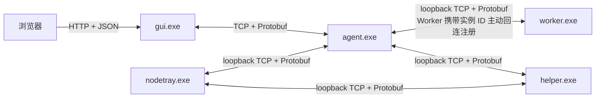
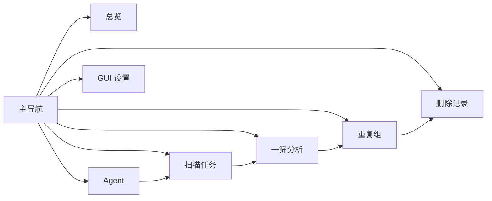
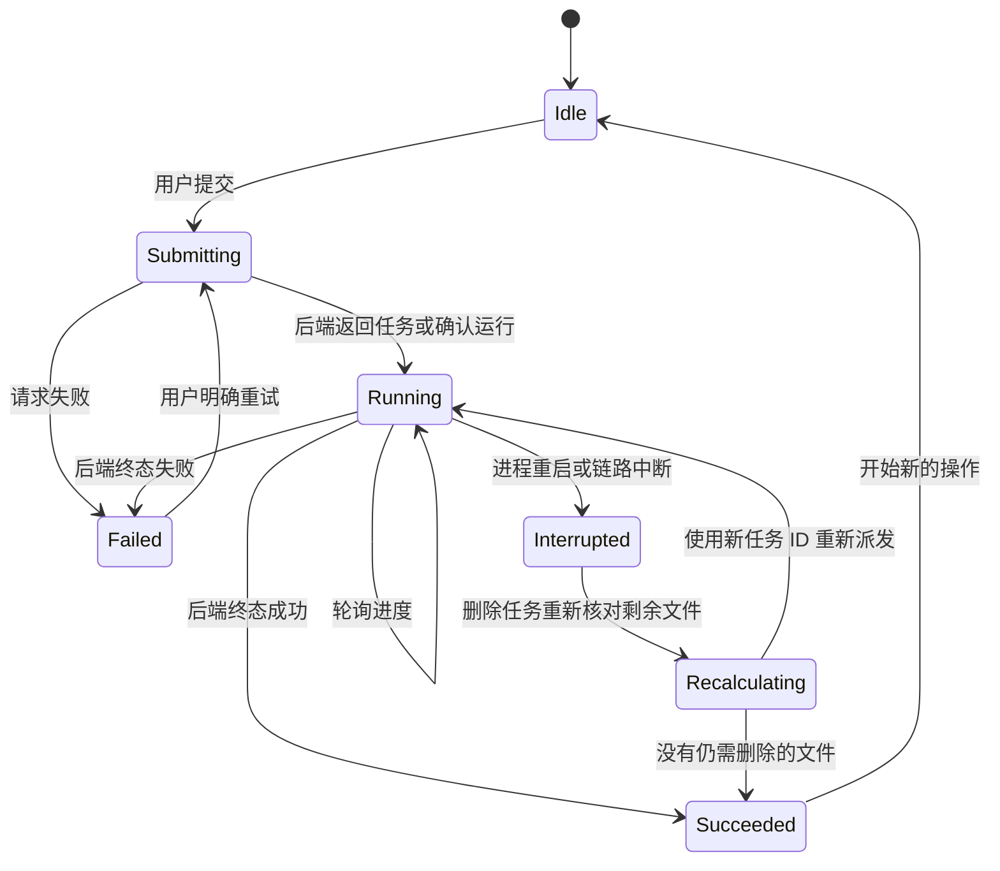
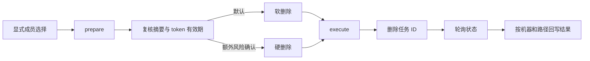
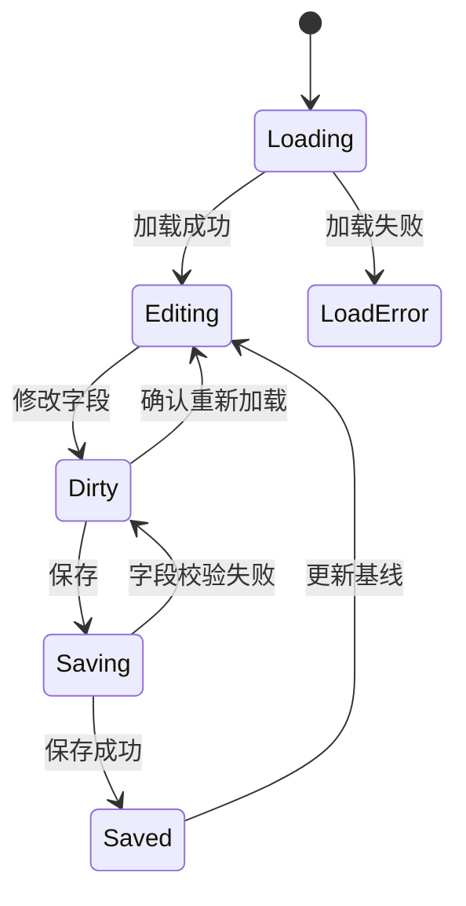

# mySingerServer Web 交互与操作设计（目标架构适配版）

> 日期：2026-08-09
> 状态：设计基线；不表示页面代码已经按本文调整完成
> 目标入口：`webui/` React 源码及 `internal/gui/web/` 内嵌生产页面
> 交互参考：`D:/code/mediaSingler/docs/superpowers/specs/2026-08-09-current-ui-functions-layout-design.md`

## 1. 设计目标

本文为 mySingerServer 中央 Web 管理页面定义统一的交互逻辑和操作逻辑，使操作员能够稳定完成：

- 查看 Agent 连接与身份状态；
- 创建扫描任务并跟踪任务状态；
- 启动一筛分析并查看最近结果；
- 在百万级数据规模下筛选和浏览重复组；
- 明确选择待删除成员并确认执行软删或硬删；
- 查看删除任务进度、失败原因和同步异常；
- 编辑、校验、保存和重新加载 GUI 配置。

设计重点是操作状态、反馈、模块边界和大数据量行为，不重新定义视觉风格。

## 2. 参考范围与禁止照搬内容

### 2.1 只引用的交互原则

从参考工具中只提取以下交互与操作机制：

- 页面或面板隐藏不等于取消后台任务；
- 会占用相同资源的操作需要明确禁用条件；
- 表单采用“编辑副本 → 校验 → 保存”流程，并支持放弃修改后重新加载；
- 长任务显示阶段、进度、统计、最近错误和终态；
- 大列表使用服务端查询、分页、虚拟化或按可见范围加载；
- 选择操作必须有明确作用域，不隐式选择未加载数据；
- 危险操作必须经过摘要复核和二次确认；
- 弹窗需要焦点约束、Escape、背景隔离和关闭后的焦点恢复；
- 长路径、任务 ID、机器 ID 和错误详情支持完整查看与复制；
- 异步区域必须区分 loading、empty、error、ready；
- 失败后保留仍然有效的用户输入和选择，提供明确重试入口。

### 2.2 不引用的内容

以下内容属于参考工具自身形态或业务能力，不进入本设计：

- Dear ImGui、Docking、Multi-Viewport 和可拖出原生窗口；
- 参考工具的停靠比例、窗口位置、深色主题、字体和按钮颜色；
- “视图”菜单、窗口显隐菜单和布局文件持久化；
- MySQL、RocksDB、Everything、视频截图、单文件诊断、磁盘信息和文件检索；
- 参考工具的报告生成、报告清理、扫描取消和断点恢复按钮；
- 参考工具的 dHash、MySQL generation 或其他专有字段；
- 浏览器关闭时终止中央后台任务的退出流程。

本项目没有对应 API 的功能不以禁用按钮、占位入口或模拟成功的方式出现在生产页面。

## 3. 当前能力事实来源

本文以当前 mySingerServer Web 和 HTTP API 为功能边界：

- 导航与路由：`webui/src/app/navigation.ts`、`App.tsx`；
- API 合同：`webui/src/api/contracts.ts`、`appApi.ts`；
- Agent：`features/agents/AgentsPage.tsx`；
- 扫描：`features/scans/ScansPage.tsx`；
- 一筛：`features/analysis/AnalysisPage.tsx`；
- 重复组：`features/groups/`；
- 删除：`features/deletion/`；
- GUI 配置：`features/settings/GUISettingsPage.tsx`；
- 后端路由：`internal/gui/httpapi.go`、`analysis.go`、`groups.go`、`delete_http.go`、`config_http.go`。

参考文档只影响交互方式，不覆盖上述源码事实和 API 边界。

### 3.1 已确认的目标架构约束

本文在保留既有页面交互逻辑的基础上，统一采用以下目标架构约束：

- 浏览器只通过 HTTP+JSON 访问 `gui.exe`，不直接连接 Agent、Worker、Helper 或 NodeTray；
- `gui.exe` 与 `agent.exe` 之间统一使用 TCP+Protobuf；
- `agent.exe` 与 `worker.exe`、`helper.exe` 之间统一使用 loopback TCP+Protobuf；
- `nodetray.exe` 与 `agent.exe`、`helper.exe` 之间统一使用 loopback TCP+Protobuf；
- TCP+Protobuf 的连接、重试、消息映射和错误转换位于各 EXE 后端，React 页面不解析 Protobuf；
- `gui.exe`、`agent.exe`、`worker.exe`、`helper.exe`、`nodetray.exe` 都有独立的配置文件读取入口、默认值和字段校验；
- Web 的设置工作区只编辑 `gui.exe` 配置。Agent、Worker、Helper、NodeTray 配置继续由各自配置文件和本机 NodeTray 管理；在没有明确 API 前，不在中央 Web 中增加虚假的全系统配置入口；
- 公用模块只是配置、Protobuf、传输、类型和错误映射等代码库，不作为独立服务、页面工作区或业务分层。

Web 请求成功仅表示 `gui.exe` 已接受或完成相应用例。涉及节点的长任务必须继续显示 Agent/Worker/Helper 返回的真实任务状态，不能把 HTTP 接受响应当作节点执行完成。

## 4. 信息架构

生产 Web 保持七个工作区：

1. 总览；
2. Agent；
3. 扫描任务；
4. 一筛分析；
5. 重复组；
6. 删除记录；
7. GUI 设置。

箭头表示常见操作顺序，不表示用户必须按顺序访问页面。

### 4.1 导航规则

- 当前工作区由 HashRouter 路由唯一标识，刷新页面后仍能回到相同工作区。
- 切换路由只销毁当前页面的临时请求和 DOM，不取消已经提交到后端的扫描、分析或删除任务。
- 应用壳持有删除操作 ID、当前派发任务 ID、执行中状态和删除复核快照，允许从“重复组”切换到“删除记录”后继续查看；浏览器刷新后通过删除任务列表重新定位，不以旧前端内存作为恢复来源。
- 兼容期可继续使用现有 `/audit` 路由，但页面名称和文档职责统一表述为“删除记录”；它是删除任务结果视图，不是独立安全或审计模块。
- 窄屏导航使用抽屉；打开时主内容设置 `inert`，Escape 或点击遮罩关闭，并把焦点恢复到菜单按钮。
- 导航文字保持稳定，不使用相同名称指向不同操作。

## 5. 全局交互规则

### 5.1 页面离开与任务生命周期

- 页面离开不等于取消任务。
- 页面组件卸载时取消的只是当前 HTTP 请求或轮询，不向后端发送任务取消命令。
- 重新进入页面后从服务端重新读取任务状态，不从旧组件内存推断任务结果。
- 浏览器刷新或关闭不终止 GUI、Agent、Worker、Helper 或其后台任务。
- 删除派发因 GUI、Agent、Helper 重启或通信中断而无法确认完成时，不直接续传旧批次：后端从已确认的显式选择中重新计算“仍存在、仍可删除且尚未完成”的文件，生成新的派发任务 ID 后重新发送。重新计算不得扩大原选择，不得改变已确认的软删/硬删模式。
- 当前 API 没有取消扫描、取消分析和取消删除接口，因此生产页面不显示相应按钮。

### 5.2 异步区域状态

每个独立数据区域必须具备四种状态：

| 状态 | 页面行为 |
| --- | --- |
| loading | 首次加载显示骨架或明确的加载说明；保留已有数据时不清空旧内容 |
| empty | 说明当前查询无结果；存在筛选时提供清除筛选入口 |
| error | 显示人读原因、重试按钮和可复制技术详情 |
| ready | 显示数据、更新时间和当前查询作用域 |

后台刷新失败时保留最近一次成功数据，并在区域顶部显示“数据可能已过期”，不得把旧数据伪装成刚刚刷新成功。

### 5.3 轮询规则

- 活动任务默认每 2 秒轮询一次。
- 页面失焦或浏览器标签不可见时可降为 10 秒，但不能停止正在运行任务的状态恢复能力。
- 所有已加载任务进入终态后停止自动轮询。
- 手动刷新立即发起新请求并取消同一区域的旧请求。
- 同一轮询区域只能存在一个活动请求，慢请求返回时不得覆盖更新的数据。
- 轮询错误采用有上限的退避，不产生失败请求风暴。

### 5.4 操作按钮

- 提交中的按钮显示进行状态并防止重复点击。
- 禁用按钮旁必须能看出禁用原因；不能只依赖不可点击状态。
- 后端仍是最终并发裁决者；前端禁用不能替代 409、400 或 503 处理。
- 操作成功后显示可定位的结果，例如任务 ID、更新时间或保存结果。
- 操作失败时保留仍然有效的表单内容、筛选条件和显式选择。

### 5.5 文本与复制

以下信息使用单行截断或受控换行，但必须支持查看完整值和复制：

- MachineID、Agent endpoint；
- 扫描任务 ID、删除任务 ID；
- 文件路径、代表路径；
- 配置字段中的监听地址和 DSN；
- 错误码、原始错误详情和同步错误。

## 6. 长任务状态模型

扫描、分析和删除采用一致的前端状态表达：

规则：

- `Submitting` 只描述提交请求，不能显示伪造进度。
- 后端返回任务 ID 后立即展示并允许复制。
- 无法确定总量时使用阶段状态和活动指示，不伪造百分比。
- 失败和中断保留最近一次有效进度、任务 ID 和错误信息。
- 删除任务重新派发时同时展示稳定的删除操作 ID、旧任务 ID、新任务 ID 和“重新计算后派发”原因；扫描和分析不套用该自动重派语义。
- 新任务开始前不清除上一次成功摘要；新状态确认后再替换。

## 7. 总览工作区

### 7.1 展示内容

- Agent：在线数量和当前已加载总数；
- 扫描任务：进行中数量和当前已加载任务数；
- 一筛分析：运行中或空闲、最近写入重复组和成员数；
- 最近错误：只展示 API 已返回的错误，不推断系统整体健康。

### 7.2 交互规则

- 每张摘要卡独立加载和失败，某一接口失败不阻断其他卡片。
- 卡片提供进入对应工作区的明确入口。
- 总览只显示“当前已加载”统计，不把分页或局部结果描述为全局总量。
- 页面隐藏后轮询可降频，重新获得焦点时立即刷新。

## 8. Agent 工作区

### 8.1 排序与状态

- 在线且身份已认领的 Agent 排在前面；
- 其余按 MachineID、endpoint 稳定排序；
- 状态固定区分：在线、离线、待识别、身份冲突；
- 身份冲突不能降级显示为普通离线。

### 8.2 操作规则

- 刷新期间保留当前表格，不闪烁为空状态；
- MachineID 和 endpoint 支持复制；
- 最近错误支持展开或复制完整详情；
- 当前页面只查看状态，不增加无后端合同的启动、停止或重启按钮；
- 身份未认领或冲突的 Agent 不能进入扫描任务可选列表。

## 9. 扫描任务工作区

### 9.1 创建扫描

操作顺序：

1. 从已认领 Agent 中选择目标机器；
2. 输入一个或多个扫描根；
3. 选择是否重新扫描；
4. 前端执行非空、重复根和目标在线状态检查；
5. 调用 `POST /api/scan`；
6. 成功后立即显示任务 ID，并刷新任务列表；
7. 失败时保留 Agent、根目录和重新扫描选项。

根目录输入可以继续使用当前竖线分隔合同；若未来改为逐项编辑控件，提交到 API 前仍转换为相同 `roots[]`，不改变后端合同。

### 9.2 禁用条件

“创建扫描任务”在以下情况禁用：

- 正在提交；
- 未选择 Agent；
- 所选 Agent 离线、待识别或身份冲突；
- 没有有效扫描根。

当前接口允许提交多个独立任务时，前端不能因为列表中存在其他任务而擅自全局禁用；任务冲突由后端返回明确错误。

### 9.3 任务状态

列表至少展示：

- 任务 ID、MachineID、状态；
- 完成数/总数、跳过、失败和扫描错误；
- 耗时、速度、最近错误、更新时间。

当 `total` 为 0 或未知时显示阶段和活动状态，不显示 `0%` 误导用户。当前 API 没有取消或恢复端点，因此不增加“取消扫描”“刷新断点”“从断点恢复”等参考工具按钮。

## 10. 一筛分析工作区

### 10.1 启动与互斥

- 页面加载时先读取当前分析状态；
- `starting`、等待状态确认或 `running=true` 时禁用重复启动；
- `POST /api/analysis/firstscreen/run` 返回 409 时显示“已有分析正在运行”，随后进入状态轮询；
- 启动请求失败时保留最近一次成功统计。

### 10.2 结果反馈

- 运行中显示明确状态，不用不真实的固定百分比；
- 完成后展示文件数、精确组、图片/视频候选、写入组/成员、坏行、跳过和内存；
- 阶段耗时按后端返回键值展示，不在前端臆造阶段；
- `lastErr` 与最近成功统计可以同时显示，避免一次失败抹掉历史结果；
- 当前接口不支持取消分析，因此不提供取消入口。

## 11. 重复组工作区

### 11.1 查询与筛选

服务端查询条件包括：

- 类型：精确、图片、视频；
- 文本搜索；
- MachineID；
- 最少成员数；
- 排序：成员数、最新、可释放空间；
- 不透明游标，固定每批 100 组。

交互规则：

- 文本搜索使用 300ms 防抖；
- 新查询取消旧请求；
- 筛选、类型或排序变化时清空游标链并重新读取首批；
- 查询条件和 cursor 进入稳定 query key，最近结果批次只使用有界缓存；
- “上一批”使用前端保存的有界 cursor 栈，“下一批”使用服务端返回的 `next_cursor`，不计算任意数字页码；
- 列表使用虚拟化，只渲染可见行和少量 overscan；
- 不把全部重复组加载进浏览器后再筛选；
- 缺少可证明总数时只显示已加载数量。

### 11.2 组选择与详情

- 点击组行选择当前组并按需加载成员；
- 详情按成员页读取，每页 100 个成员；
- 切换组时取消旧详情请求，旧请求不得覆盖新组；
- 代表文件固定显示且不可加入删除清单；
- 成员展示 MachineID、路径、大小、时间和后端可提供的评分；
- 离线 Agent、身份冲突或无法复核的成员显示不可执行原因；
- 详情加载失败不清空组列表，允许只重试详情。

宽屏采用列表与详情并行工作区；窄于 1280px 时详情使用右侧抽屉。抽屉必须锁定焦点、隔离背景并在关闭后把焦点恢复到原组行。该规则只描述操作关系，不规定视觉风格。

### 11.3 删除选择语义

- 只有用户逐项明确勾选的成员进入删除清单；
- 代表文件永远不可选择；
- 离线或不可验证成员不可选择；
- 表头全选只影响当前已加载成员页；
- 未加载成员和其他组不得隐式加入；
- 查询条件、重复类型或排序变化时清空与原作用域不兼容的选择并提示；
- 同组必须至少保留一个有效成员；
- 选择摘要显示文件数、总大小和涉及机器数；
- 页面离开可以保留删除复核快照，但不能自动扩大选择范围。

## 12. 删除确认与删除记录

### 12.1 两阶段确认流程

具体规则：

1. 用户点击“检查删除清单”后调用 `POST /api/delete/prepare`；
2. prepare 成功后展示文件数、总大小、机器分布、样本路径和 token 剩余时间；
3. 默认删除模式为软删除；
4. 硬删除必须重新选择并完成额外风险确认；
5. token 到期后禁用最终确认，丢弃旧摘要，必须重新 prepare；
6. 执行期间锁定弹窗关闭和导航中会破坏选择的操作；
7. execute 成功后显示删除任务 ID，并允许切换到“删除记录”；
8. prepare 或 execute 失败时不显示旧摘要为当前有效摘要；
9. Helper 不可达、选择冲突、确认失效和权限错误分别显示明确原因。

删除执行建立一个稳定的删除操作 ID，每次实际派发使用独立任务 ID。进程重启或通信中断后，GUI 根据原始显式选择、已确认模式和当前文件状态重新核对剩余文件；仍符合条件的文件使用新任务 ID 重新派发，已成功、已不存在或已不符合删除条件的文件不再发送。该流程不恢复旧 token、不重放旧消息序列，也不引入分析版本判断。

### 12.2 删除结果

- 总数拆分为成功、失败、待处理和不确定；
- `uncertain` 已包含在后端失败语义中，汇总重试数量时不得再次与 `failed` 相加；
- 按 MachineID 展示机器级完成情况、序列进度和状态同步失败；
- 文件级问题按 `(machineId, path)` 映射回原选择；
- 成功项从当前重复组移除；失败和不确定项保留并显示原因；
- Agent 离线时保留不协调快照，重新在线并复核后才恢复其显式选择；
- 重试只包含后端明确可重试且仍然符合删除条件的项目；
- 删除记录按稳定操作 ID 展示各次派发任务及中断原因；同一路径的最终状态以最新重新核对结果为准；
- 删除记录页启动时读取活动和最近操作列表；没有记录时显示空状态并提供返回重复组的入口。

## 13. GUI 设置工作区

该工作区只管理 `gui.exe` 自己的配置文件，不负责直接修改其他 EXE 配置。其他进程的配置读取和生效规则保持独立：

| EXE | 配置入口职责 | Web 中的处理 |
| --- | --- | --- |
| `gui.exe` | HTTP 地址、PostgreSQL、Agent 端点、一筛和 Phase2 参数 | 允许在 GUI 设置页编辑、校验和保存 |
| `agent.exe` | 扫描、同步、Worker 池、单一 Worker TCP 监听、背压和节点通信 | 只展示后端已经提供的运行状态，不在中央 Web 编辑 |
| `worker.exe` | TCP 回连参数、媒体读取、内存、缓存和超时；实际 Agent 端点与实例 ID 由启动参数提供 | 不直接暴露给 Web |
| `helper.exe` | TCP 端点、删除批次、执行模式和超时 | 不直接暴露给 Web |
| `nodetray.exe` | 本机组件路径、配置路径、启动方式和刷新设置 | 由 NodeTray 本机页面管理 |

配置文件保存后，由对应 EXE 在启动、重载或重启时自行读取并校验。`gui.exe` 不向其他进程推送隐式配置，也不把公用配置代码库当成集中配置服务。

### 13.1 编辑状态

页面同时维护：

- 最近一次成功加载的配置快照；
- 当前表单编辑副本；
- 字段级校验错误；
- 保存中、保存结果和 `restartRequired` 状态。

任何字段修改后标记为“有未保存修改”。离开页面或点击重新加载时，如果存在未保存修改，应先确认是否放弃。

### 13.2 保存流程

规则：

- 保存前执行前端基础校验，但以后端字段校验为最终结果；
- 后端字段错误准确映射到 `listen_addr`、`pg_dsn`、`agents[i].addr`、一筛和二筛字段；
- 保存失败不清空编辑值；
- 保存成功后更新基线，并明确显示是否需要重启 GUI；
- “重新加载”放弃本地编辑并重新读取磁盘配置；
- DSN 默认掩码显示，只有用户明确操作时临时显示；
- Agent 地址支持添加、删除和排序，至少保留一个；
- 配置保存不自动重启 GUI，也不伪装运行时已经采用新配置。

## 14. 操作禁用矩阵

| 操作 | 允许条件 | 禁用或阻止条件 | 离开页面后的行为 |
| --- | --- | --- | --- |
| 创建扫描任务 | Agent 已认领且在线；根目录有效 | 提交中、Agent 无效、根为空 | 已创建任务继续运行 |
| 启动一筛 | 当前未运行 | 启动中、等待确认、运行中 | 分析继续运行 |
| 选择删除成员 | 非代表、Agent 在线、成员可复核 | 代表、离线、冲突、删除锁定 | 可保留显式复核快照 |
| prepare 删除 | 选择非空且作用域稳定 | 无选择、成员失效、请求中 | 不取消已完成 prepare，但 token 继续计时 |
| execute 删除 | token 有效且完成确认 | token 到期、执行中、选择冲突 | 删除继续运行；中断后重新计算剩余文件并以新任务 ID 派发 |
| 保存配置 | 编辑值可提交 | 加载中、保存中、字段无效 | 未保存编辑离开前确认 |
| 重新加载配置 | 当前无保存请求 | 保存中；脏表单未确认放弃 | 重新读取磁盘配置 |

跨任务互斥必须来自明确的后端合同。前端不能因为“看起来可能冲突”就新增全局锁，也不能忽略后端返回的冲突状态。

## 15. 错误、警告与通知

### 15.1 错误展示

- 页面级错误出现在所属工作区，不使用容易消失的 toast 作为唯一反馈；
- 字段错误紧邻字段，同时在保存区提供汇总；
- 技术详情默认折叠，但支持复制；
- API 503 显示服务不可用和重试入口，不使用本地模拟成功；
- API 409 转换为对应的“已有任务运行”或“选择冲突”状态；
- 网络中断保留最近成功数据并标记可能过期；
- 同一轮询错误在内容未变化时合并显示，避免重复刷屏。

### 15.2 危险操作

- 危险操作使用明确文字，不能只用图标；
- 软删除和硬删除在确认界面中分开说明；
- 硬删除必须额外确认，不允许沿用上次模式；
- 弹窗关闭、Escape 和取消都不能触发执行；
- 删除执行期间不允许关闭关键确认层并重新提交同一 token。

## 16. 百万级数据约束

- 重复组固定服务端游标分页，每批 100 组；
- 成员固定按需分页，每页 100 项；
- 列表和成员区域使用虚拟化；
- 搜索防抖并取消过期请求；
- 查询缓存必须有数量或内存上限；
- 筛选和排序在服务端执行；
- 前端不持有全库成员选择集合；
- 图片或视频预览按需加载并在离开缓存范围后释放；
- 表头全选只操作当前页；
- 没有服务端查询快照 token 时，不提供“选择全部查询结果”。

## 17. 无障碍与响应式交互

- 所有操作可使用键盘完成；
- 按钮、复选框、输入框和表格行具有可读标签；
- 焦点环始终可见；
- 弹窗和抽屉按 DOM 顺序收集可聚焦控件，并排除禁用控件；
- Escape 关闭非执行锁定状态的弹窗或抽屉；
- 关闭后恢复到触发控件；
- 状态不只依赖颜色，同时显示文字或图标；
- 支持 `prefers-reduced-motion`；
- 1280px 以上保持列表与详情并列；更窄时详情变为抽屉；
- 手机只保证查看、刷新和基础任务操作，不开放批量删除。

## 18. API 操作映射

| Web 操作 | 当前或目标 API | 交互结果 |
| --- | --- | --- |
| 刷新 Agent | `GET /api/agents` | 更新在线、身份和错误状态 |
| 创建扫描 | `POST /api/scan` | 返回并展示任务 ID |
| 查看扫描 | `GET /api/tasks` | 轮询任务状态与统计 |
| 启动一筛 | `POST /api/analysis/firstscreen/run` | 启动或返回已有任务冲突 |
| 查看一筛 | `GET /api/analysis/firstscreen/status` | 轮询运行状态和最近统计 |
| 查询重复组 | `GET /api/groups?cursor=...&size=100` | 新 Web 使用服务端游标分页；兼容期仅旧页面使用浅页 page 参数 |
| 查看组成员 | `GET /api/groups/{id}` | 按成员页加载详情 |
| 准备删除 | `POST /api/delete/prepare` | 返回摘要、token 和有效期 |
| 执行删除 | `POST /api/delete/execute` | 返回稳定删除操作 ID 和本次派发任务 ID |
| 查询删除记录 | `GET /api/delete/tasks` | 返回活动和最近删除操作，用于刷新后重新定位 |
| 查看删除 | `GET /api/delete/tasks/{task_id}` | 轮询机器、序列、文件级结果和重新派发关系 |
| 读取 GUI 配置 | `GET /api/config` | 建立编辑基线和重启状态 |
| 保存 GUI 配置 | `PUT /api/config` | 返回保存结果和是否需重启 |

## 19. 明确不做

- 不复制参考工具的视觉主题或窗口布局；
- 不新增 Docking、多窗口、布局文件和“视图”菜单；
- 不新增没有目标合同的用户手动取消、暂停、断点、日志或诊断按钮；删除中断恢复由后端重新计算并重新派发，不表现为用户手动续传旧任务；
- 不改变扫描、一筛和删除显式选择、两阶段确认等业务语义；目标 API 只增加游标分页和删除中断后的重新派发能力；
- 不把全量重复组或成员加载到浏览器；
- 不隐式选择未加载、离线、代表或不可验证文件；
- 不让页面路由控制后台进程生命周期；
- 不以 fixtures 或模拟成功替代生产服务失败；
- 不让浏览器直接连接任一节点 EXE 或解析 Protobuf；
- 不把公用代码库设计成独立服务或独立页面；
- 不增加独立的“安全中心”“权限中心”或“审计中心”。必要的确认、错误提示和执行约束归入现有配置、任务和删除流程。

## 20. 验收标准

- [ ] 七个工作区的导航与当前路由保持一致；
- [ ] 切换页面不会取消已提交的后台任务；
- [ ] Agent 状态区分在线、离线、待识别和身份冲突；
- [ ] 扫描提交失败保留表单，成功后立即显示任务 ID；
- [ ] 一筛运行中不可重复启动，409 能恢复为运行中状态；
- [ ] 重复组使用服务端筛选、不透明 cursor、固定 100 条批次和虚拟化；新 Web 不发送数字页码；
- [ ] 筛选变化不会保留不兼容的删除选择；
- [ ] 代表文件、离线和不可验证成员不可加入删除清单；
- [ ] 删除严格执行 prepare → 摘要复核 → execute → 状态轮询；
- [ ] 软删除为默认模式，硬删除需要额外确认；
- [ ] token 到期后必须重新 prepare；
- [ ] 删除结果按 MachineID 和路径回写，失败和不确定项可追踪；
- [ ] 删除链路重启或中断后重新核对原显式选择，只将仍需删除的文件以新任务 ID 派发；不得扩大选择或复用旧 token；
- [ ] 浏览器刷新后可从删除任务列表重新定位活动或最近删除操作；
- [ ] GUI 配置支持编辑、字段校验、保存、放弃修改和重新加载；
- [ ] 保存配置后明确显示 `restartRequired`，不自动重启；
- [ ] loading、empty、error、ready 状态在每个独立数据区域可区分；
- [ ] 弹窗和抽屉支持键盘、焦点约束、Escape 和焦点恢复；
- [ ] 窄屏不开放批量删除；
- [ ] 页面不出现没有后端合同的假按钮或模拟成功。
- [ ] 浏览器只通过 HTTP+JSON 访问 GUI，不直接访问节点 EXE；
- [ ] EXE 间目标通信统一表述为 TCP+Protobuf；
- [ ] 五个 EXE 的配置由各自配置读取模块负责，Web 设置页只编辑 GUI 配置；
- [ ] 公用代码库不作为服务、页面或独立业务分层；
- [ ] “删除记录”只承担任务结果查看，不扩展为独立安全或审计中心。

## 21. 与参考文档的关系

本文只继承参考工具已验证过的操作原则：状态保留、任务互斥、长任务反馈、显式选择、危险操作确认、虚拟化、表单保存/重载和弹窗焦点管理。

本项目的数据模型、API、错误语义和响应式形态以 mySingerServer 当前源码为事实来源；目标通信、独立配置读取、公用代码库和模块边界以已确认的目标架构为准。参考工具的视觉、Docking、窗口布局和专有功能没有进入本设计。
