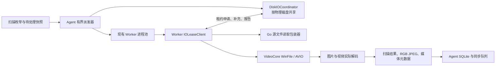

# 自适应磁盘 I/O、RGB 视频缩略图与完整视频元数据设计

日期：2026-08-17
状态：已完成交互式设计确认，等待书面规格复核

## 1. 背景

当前 Compute 已有固定大小的 Worker 进程池。现场配置启动 24 个 Worker，但 HDD 图片扫描路径在 `internal/agent/scan.go` 中固定使用单个流，并且每个扫描 goroutine 提交一个媒体任务后同步等待终态结果，再提交下一个任务。因此大量时间只有一个媒体任务在飞，其余 Worker 处于空闲状态。问题不是缺少 Worker 进程池，而是扫描派发和源媒体读取没有形成有界流水线。

Worker 当前自行打开源文件。VideoCore 已使用自定义 `AVIOContext -> WinFile` 完成 FFmpeg 视频读取与 seek；图片、哈希和最终文件一致性复核也发生在 Worker 内。这个边界允许 Worker 保留文件句柄，同时让 Agent 统一控制每块物理磁盘的读取配额，无须传输媒体字节，也无须新增 `reader.exe`。

现有视频接触表缩略图使用 `GRAY8` 画布和 `TJSAMP_GRAY` JPEG，不能保留视频颜色；缓存还会生成 `.jpg.json` 元数据旁车和 `.jpg.lock` 锁文件。数据库目前只保存视频时长、缩略图结果和六帧特征，没有保存容器和全部轨道元数据。

## 2. 目标

本设计以同一完整扫描任务的墙钟时间最短为第一目标，不以 CPU 或磁盘利用率曲线平滑为目标，并允许利用率随媒体类型和磁盘状态波动。

具体目标如下：

1. 保留现有 Worker 进程池，在 Agent 内新增按物理磁盘共享的 I/O 调度池。
2. Worker 保留源文件句柄，并在每次 read/seek 前检查和消费有效读配额。
3. 根据实际有效吞吐、等待和 seek 压力自适应增加或降低磁盘并发。
4. 同一物理磁盘上的多个任务共享调度器；每个任务获得最低公平服务，其余能力按吞吐竞争。
5. 暂停、停止、删除和关机继续具备可界定的排空语义。
6. 视频缩略图从真实视频轨道解码为 `R8G8B8` 彩色像素并输出彩色 JPEG。
7. 缩略图缓存目录只保存最终 JPEG，不保存版本目录、JSON 旁车、锁文件或缩略图缓存元数据。
8. SQLite 保存媒体容器信息及全部视频、音频、字幕、数据和附件轨道元数据。

## 3. 非目标

1. 不新增独立读取进程，不通过 IPC 传输视频或图片字节。
2. 不通过延长媒体解码超时、跳过文件或无条件重试来制造吞吐提升。
3. 不把 CPU 或磁盘利用率固定在某个百分比。
4. 不改变既有图片和视频相似度特征的定义。
5. 不在本变更中删除旧 `thumbcache\vc-grid-v1` 目录；该目录由用户以后手动清理。
6. 不把现有媒体损坏或编解码兼容问题伪装成调度错误；两者必须保持独立错误分类。

## 4. 总体架构



媒体字节始终从磁盘直接进入 Worker；Agent 只处理调度控制消息和统计。

## 5. 物理磁盘身份与共享范围

Agent 在枚举或准备工作时把路径映射为稳定的磁盘调度键：

1. Windows 本地卷使用卷标识和磁盘 extents 解析物理磁盘。
2. 同一物理磁盘上的多个盘符或分区共享同一个 `DiskIOCoordinator`。
3. 跨多个物理磁盘的卷使用保守的共享组合键，不能被误判成多个独立无限预算。
4. 无法取得物理磁盘身份时退化到受控的卷级调度桶，不允许绕过调度直接读取。
5. 网络路径使用独立的网络源调度键，不能与本地磁盘混用统计。

调度器在 Agent 进程内共享。Agent 重启后重新学习，不把可能因硬件或外部负载变化而过期的最优并发持久化。

## 6. Agent 有界派发器

当前 HDD 图片固定单流和“提交一个、等待一个”的结构改为有界流水线：

1. 枚举与 `PendingSnapshot` 仍决定精确工作集合。
2. 每块磁盘维护有界待派发队列，队列容量受 Worker 数和内存预算限制。
3. Agent 可以同时向现有 Worker 池提交多个文件任务，但实际源文件读取必须取得磁盘租约。
4. 文件进度只在 Worker 结果持久化后递增，排队、租约等待或已提交状态都不算完成。
5. 停止接收新工作后，未派发项保持未完成；不能因排队取消而被计为成功或跳过。
6. 当前按图片、其他文件、视频分三段处理的 HDD 策略可保留为工作分类，但不再把图片阶段硬编码为单任务执行。调度器依据顺序读和随机读反馈决定实际并发。

## 7. Worker 本地租约客户端

现有 Worker 与 Agent 命名管道增加兼容的消息类型：

- `IOLeaseAcquire`：任务、Worker、磁盘键、操作类型、期望字节数和取消身份；
- `IOLeaseGrant`：租约 ID、字节预算、seek 预算、有效期和调度代次；
- `IOLeaseReport`：实际字节数、读耗时、seek 数、租约等待和完成/取消状态；
- `IOLeaseCancel`：任务排空或调度代次失效。

Worker 保存小型本地租约窗口：

1. 每次 read 前先从有效字节预算扣减；预算不足时才通过 IPC 补充，避免每个 64 KiB FFmpeg 读取都跨进程往返。
2. 顺序读初始租约窗口为 4 MiB，可在 1–16 MiB 之间调整。
3. 每次 seek 必须消费独立的随机读令牌；seek 后的读取使用随令牌下发的小型字节窗口。
4. 每次操作仍会本地检查租约，所以不存在未授权 read/seek。
5. Worker 关闭、崩溃或管道断开时，Agent 回收该 Worker 未使用的租约能力。
6. Agent 或租约协议不可用时不得退化为无配额直读；工作按基础设施故障回收，由现有监督机制在身份仍匹配时安全重派，不计为媒体损坏。

## 8. VideoCore 与 Go 读取接入

VideoCore 现有 `AVIOContext` 已集中经过 `WinFile::Read` 和 `WinFile::Seek`。生产 ABI 增加只传递数字句柄的 I/O governor 回调，避免把 Go 指针交给 C++：

1. `WinFile::Read` 在调用 `ReadFile` 前取得/消费字节配额，完成后记录真实传输量和耗时。
2. `WinFile::Seek` 在调用 `SetFilePointerEx` 前取得 seek 令牌并报告新位置。
3. 回调等待可被任务取消、暂停、停止和进程关机中断。
4. Worker 内 Go 实现的源文件哈希、最终一致性复核和其他源媒体读取使用同一 `IOLeaseClient` 包装器。
5. 缩略图缓存、临时 JPEG、SQLite、日志和其他非源媒体文件不进入源盘调度器，避免调度器自锁。

租约等待时间不计入 VideoCore 探测和解码超时。超时预算继续覆盖实际读盘、seek、解码和算法执行；否则高负载下正常媒体会因为等待公平配额而被误报为解码超时。

## 9. 自适应算法

每个物理磁盘维护顺序读和随机读观测，但共享一个总并发预算。

### 9.1 起始值与上限

- HDD 初始并发为 2；SSD 初始并发为 4。
- 默认总上限不超过 Worker 数和 24。
- HDD 随机读默认上限为 8。
- 最终上限同时受 Worker 数、有界待处理内存和管理员配置硬限制约束。

### 9.2 观测窗口

一个有效观测窗口至少持续 2 秒并包含足够的实际读取量。统计项包括：

- 有效源媒体字节/秒；
- 已完成持久化工作量；
- P50/P95 实际读耗时和租约等待；
- 顺序读取量和随机 seek 数；
- Worker 忙碌数、等待 I/O 数和可用 Worker 数；
- 队列深度和任务数。

### 9.3 爬坡与回退

1. 有排队工作且存在可利用 Worker 时，尝试把并发增加 1。
2. 有效吞吐提升至少 5%时保留新并发并继续爬坡。
3. 吞吐下降超过 8%、P95 实际读取延迟显著上升或随机 seek 拥塞时，降低 1 到当前并发的 25%。
4. 达到平台后周期性探测 `当前值 + 1`，适应缓存、媒体类型和其他程序负载变化。
5. Worker 全忙时停止继续增加读并发；Worker 大量空闲且磁盘队列持续有工作时允许快速爬升。
6. 算法不追求稳定利用率，只接受能改善完整流水线有效吞吐的并发。

所有阈值集中在可测试的调度策略配置中，不散落到扫描代码。

## 10. 多任务公平性

同一物理磁盘的多个任务共享预算：

1. 在 Worker 和磁盘能力允许时，每个有排队工作的任务至少保留一个服务份额。
2. 剩余份额按实际吞吐贡献和等待年龄竞争分配。
3. 活跃任务数超过可用 Worker 或磁盘并发时，通过轮转兑现最低份额，不能虚假承诺同时为每个任务占有一个 Worker。
4. 任务等待年龄会提高调度优先级，防止小任务或低吞吐任务永久饥饿。
5. 暂停、停止或删除任务立即退出竞争并取消其等待申请。

## 11. 排空、错误与恢复

1. 暂停、停止、删除和关机优先于新租约；等待中的申请立即取消。
2. 已发租约窗口有严格上限，Worker 最多完成当前小窗口后进入既有排空边界。
3. 同步 `ReadFile` 已开始后不能伪装成已取消；完成后先检查任务身份和取消状态，再决定是否提交结果。
4. Worker 崩溃后回收租约，工作按现有精确实例身份和 revision 规则重派。
5. 过期代次、实例不匹配和 stale revision 的租约报告只用于回收，不能更新当前任务进度。
6. 调度器错误使用独立稳定错误码，不得写入文件的媒体解码错误字段。
7. 真实文件 I/O、格式损坏和解码器错误继续按具体阶段记录，失败集合不能因启用调度器而变化。
8. 所有队列、租约和统计缓存都有硬上限，不能以吞吐为理由无限增长。

## 12. 可观测性与任务卡

任务快照和结构化日志增加：

- 当前磁盘调度并发；
- 有效读取速度；
- I/O 租约等待时间；
- 顺序读取字节数；
- 随机 seek 数；
- Worker 忙碌数与等待 I/O 数。

任务卡继续显示主要速度、阶段、进度和完整失败摘要；详细 I/O 指标进入可展开详情，避免挤压和截断主要文字。未知或基础设施错误仍使用稳定安全摘要，原始内部错误只写结构化日志和错误详情数据源。

## 13. RGB 视频缩略图

### 13.1 解码和合成

1. 使用实际选中的视频轨道及其 codec ID 查找并打开对应 FFmpeg 解码器。
2. 每个采样 `AVFrame` 按帧/轨道的 color range、colorspace、transfer 和 primaries 转换为 `AV_PIX_FMT_RGB24`。
3. 内存通道顺序固定为 `R8G8B8`。
4. 每帧只保留缩放到 tile 上限的 RGB 数据，不能在多个 Worker 中长期保存完整 4K/8K RGB 帧。
5. 六个 RGB tile 合成 RGB24 画布；缺帧位置使用中性深色 RGB 占位。
6. TurboJPEG 使用 `TJPF_RGB`、彩色 4:2:0 采样和质量 90 写出标准彩色 JPEG，不再使用 `GRAY8` 或 `TJSAMP_GRAY`。

### 13.2 特征兼容

六帧 PDQ、pHash 和 Sobel 继续使用现有灰度特征支路。接触表特征使用并行的既有灰度画布计算，RGB JPEG 的引入不能静默改变已冻结的查重语义。RGB 画布只负责用户可见缩略图。

## 14. 无旁车缩略图缓存

最终路径固定为：

```text
thumbcache\<SHA-512 前两位>\<SHA-512>.jpg
```

规则如下：

1. 不创建版本目录。
2. 不生成 `.jpg.json`、`.jpg.lock`，也不在 JPEG 内嵌缓存元数据。
3. 数据库不保存缩略图生成版本、生成时间、JPEG 摘要或其他缩略图缓存元数据。
4. `video_features` 中现有缩略图路径、尺寸和指纹属于扫描业务结果，继续保留。
5. Agent 的 SHA 单飞阻止同一 Agent 下的常规重复生成。
6. 每个 Worker 先写同目录唯一 `.jpg.tmp-<pid>-<job>-<nonce>`，完整写入、同步并验证为三颜色分量 JPEG后，再使用 Windows 原子替换发布。
7. 并发发布时最后一个完整且验证通过的原子发布结果成为唯一最终文件；读取者不能看到半写入文件。
8. 普通扫描复用当前完整、非零且可解析为三颜色分量的 JPEG。
9. 强制重算重新生成并覆盖同一路径，覆盖后即为最新结果。
10. JPEG 存在但数据库缺少缩略图指纹或尺寸时，从 JPEG 重算业务特征，不重新解码原视频。
11. 启动或发布时清理超过既定寿命的 `.jpg.tmp-*`，不删除最终 JPEG。
12. 旧 `thumbcache\vc-grid-v1` 不读取、不迁移、不自动删除，由用户手动清理。

## 15. 视频容器与全部轨道元数据

缩略图不保存缓存元数据，但数据库必须保存真实媒体元数据。

### 15.1 `video_containers`

以 `sha512` 为主键，保存：

- 容器格式名称和长名称；
- 起始时间、时长和总码率；
- 文件大小和 FFmpeg probe score；
- 容器 tags 的长度受限规范 JSON；
- 实际选中的主视频轨道索引；
- 实际使用的解码器名称。

### 15.2 `video_streams`

以 `(sha512, stream_index)` 为主键，保存全部视频、音频、字幕、data 和 attachment 轨道：

- 轨道类型、codec ID、codec name、codec long name和 codec tag；
- profile、level、time base、起始时间、时长、码率和可用时的帧数；
- disposition、语言、标题和长度受限规范 tags JSON；
- 视频轨道的像素格式、位深、宽高、SAR/DAR、平均/原始帧率、旋转、色彩范围、色彩空间、transfer、primaries、chroma location和 field order；
- 音频轨道的采样格式、采样率、声道数、channel layout和位深。

不适用于某类轨道的列使用 NULL，不能用虚假零值冒充媒体声明。

### 15.3 提取、协议和持久化

1. 直接从 VideoCore 已打开的 `AVFormatContext` 提取，不启动额外 `ffprobe.exe`，不重复读取源视频。
2. VideoCore C ABI 增加容器查询和逐轨道枚举接口；固定字段使用带 `struct_size`/ABI 版本的结构体，可变 tags 通过长度受限的复制接口取得。
3. Worker 协议增加容器和轨道数组，并校验轨道索引唯一、类型合法、数量和总字节数受限。
4. Agent 在同一事务中 upsert `video_containers`，删除该 SHA 旧轨道并写入完整新轨道集合。
5. 强制重算替换整个集合；普通扫描按 SHA 复用。
6. 新增独立的视频元数据字段位。探测成功后即使缩略图或部分帧失败，元数据仍可持久化，文件表现为部分成功而不是丢失全部结果。
7. 新表进入现有同步队列；Compute 和 Manager 使用相同的容器/轨道数据契约。
8. 既有数据库迁移到下一 schema version；旧 `video_features` 和 `video_frames` 数据原样保留，新增元数据缺失会在后续扫描时按字段位补齐。

## 16. 测试策略

### 16.1 调度单元测试

- 使用假时钟和确定性通道验证并发爬升、回退和平台探测；
- 验证顺序读与随机 seek 对预算的不同影响；
- 验证多任务最低份额、轮转和防饥饿；
- 验证队列和租约上限；
- 不使用 `Sleep` 判断竞态。

### 16.2 Worker 与协议测试

- 租约消息 round-trip、合法性和总大小限制；
- 每次 read/seek 前必须存在有效本地租约；
- 租约耗尽补充、取消、过期代次和断线回收；
- Worker 崩溃后任务身份不串用；
- `go test -race` 覆盖 Agent 和 Worker 池。

### 16.3 VideoCore 测试

- 原生 I/O hook 证明 `ReadFile`/`SetFilePointerEx` 前已经授权；
- 租约等待不消耗媒体操作超时，实际 I/O 和解码仍消耗；
- H.264、HEVC 及现有冻结样本使用真实 codec 解码；
- 输出 JPEG 为三颜色分量，非灰度；
- RGB 通道顺序和颜色转换用已知色块 fixture 验证；
- 既有六帧和接触表特征 golden 不变；
- 缓存目录最终只有分片 JPEG，测试中不得出现 `.json` 或 `.lock`。

### 16.4 数据库与同步测试

- 真实 SQLite schema 迁移；
- 容器和全部轨道原子替换；
- NULL 与零值语义；
- 轨道 tags 大小、重复索引和恶意数量拒绝；
- 部分媒体结果仍保存成功探测的元数据；
- Compute 到 Manager 同步 round-trip 不丢字段。

## 17. 生产性能与正确性验收

在 `I:\MiddleDir\11111111` 上使用相同产品构建和相同扫描字段比较固定串行基线与自适应版本：

1. 完整任务结果集合、SHA、图片特征、视频六帧特征及失败集合必须一致。
2. 自适应版本完整墙钟时间不得比基线回退超过 3%。
3. 目标是完整墙钟时间至少缩短 20%。
4. 验收记录每块物理磁盘的并发轨迹、有效吞吐、seek 数、租约等待和 Worker 状态。
5. 彩色视频缩略图必须来自实际视频解码，不允许用占位图冒充成功。
6. 随机抽检 H.264、HEVC 和其他实际 codec，数据库所记主轨道和解码器必须与媒体一致。
7. 中途执行暂停、恢复和停止，确认进度、结果及排空边界正确。

当前 D 盘曾只剩约 1.31 GiB，并出现日志写入空间不足。正式基准前必须提供足够工作空间，否则结果标为无效；本设计不授权自动删除用户文件或旧缓存。

## 18. 发布与兼容边界

1. Worker IPC 和 VideoCore ABI 按现有版本握手 fail closed；Agent、Worker 和 DLL 必须作为同一发布闭包升级。
2. 新 SQLite schema 迁移必须在事务内完成，并通过现有 schema 结构校验。
3. 旧缩略图版本目录保持不变；新版本只读写分片根路径。
4. 新 RGB JPEG 与视频元数据成功完成静态、单元、集成、race、原生 CTest 和真实媒体验收后，才允许重新打包 Compute/Manager。
5. 部署继续保留现有 `data` 和 `local-control.token` ACL，不复制、重建或修改 token 权限。

## 19. 已确认的决策摘要

- 优化目标：全量扫描墙钟时间最短。
- 调度位置：Agent 内集中式每物理磁盘 I/O 调度池。
- 文件所有权：Worker 保留文件句柄，read/seek 前消费租约。
- 多任务：最低公平份额加吞吐竞争。
- 利用率：允许 CPU/磁盘波动。
- 缩略图：RGB24 `R8G8B8` 合成，最终仍为彩色 JPEG。
- 缓存路径：`thumbcache\<前两位>\<SHA512>.jpg`。
- 缓存旁车：无版本目录、无 `.json`、无 `.lock`、无缩略图缓存元数据。
- 视频元数据：数据库保存容器和全部轨道。
- 旧缓存：不处理，用户以后手动清理。
