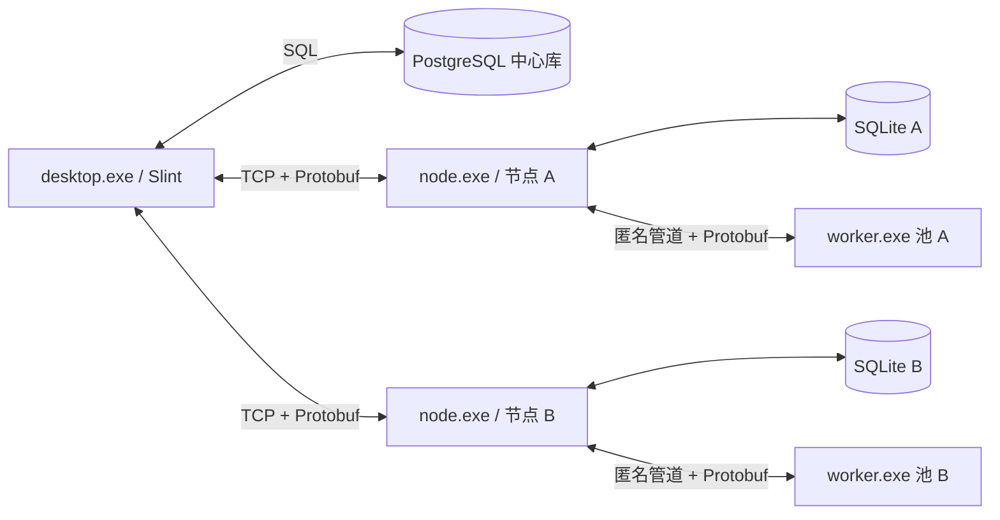

# mySingerServer Rust V2 媒体去重系统设计

## 1. 状态与结论

本设计已由项目负责人于 2026-08-19 逐节确认。

项目采用 Rust 从零整体重写。新实现只面向 Windows x64，不兼容旧版代码、
协议、数据库或配置。产品由管理工具、计算节点和隔离 Worker 三类进程组成：

- `desktop.exe`：Slint 管理界面，可同时连接局域网内多个计算节点。
- `node.exe`：带 Windows 托盘图标的计算节点，持有本机 SQLite 和任务状态。
- `worker.exe`：隔离媒体解码、哈希及图片/视频特征计算。

单机模式由 `desktop.exe` 连接本机 `node.exe`，不需要 PostgreSQL；除跨机器
去重外，扫描、精确重复、相似图片、相似视频、预览和删除均可本地完成。
跨机器模式由一个 `desktop.exe` 同时连接多个 `node.exe`，并使用 PostgreSQL
保存中心数据和执行跨机器候选筛选。

本设计借鉴 Czkawka 的任务分类、重复组复核和低干扰界面理念，但不复用其
内部结构。新系统针对多计算节点、中心同步和按需二筛重新设计。

## 2. 目标

1. 使用清晰、短路径、易测试的 Rust 模块替换旧项目的混合职责结构。
2. 计算节点可独立保存数据并完成单机媒体去重。
3. 管理工具可通过手工配置的 `IP:端口` 同时控制多个局域网节点。
4. 使用 TCP + Protobuf 统一承载任务、进度、结果、预览、同步和删除命令。
5. 精确重复使用 MD5 生成候选，再用文件大小确认。
6. 相似图片使用 PDQ 一筛，以及“9 分块 pHash + 128 维 Sobel”联合二筛。
7. 相似视频固定抽取六帧，每帧使用与图片一致的两层筛选并计算平均分。
8. 单机结果保存在 SQLite；管理工具支持自动和手动同步到 PostgreSQL。
9. 默认删除到 Windows 回收站，并允许在设置中切换为永久删除。
10. 视频使用 FFmpeg 共享 DLL 解码，不启动任何 FFmpeg 可执行程序。

## 3. 强制实施约束

### 3.1 范围约束

- 不扩大已确认需求。新的功能设想必须先单独确认，不能在实现过程中顺手加入。
- 不实现旧协议、旧表结构、旧配置、旧接口或旧数据迁移兼容层。
- 不加入节点自动发现、账号、认证、权限、TLS、消息加密或证书管理。
- 不加入云服务、浏览器管理端、移动端、自动删除策略或无人值守删除。
- 不为算法结果保存算法版本字段，也不设计算法版本迁移机制。
- 不生成相似图片缩略图；图片预览只在用户选中时读取原文件。
- 不设计多个管理工具实例之间的主从、选举或任务协调。一个管理工具实例可连接
  多个节点，这已经覆盖本设计的多主机目标。

### 3.2 简洁实现约束

- 不添加过多防御性编程。配置、TCP 消息、数据库行和文件路径在进入系统边界时
  校验一次，内部使用已验证的强类型数据，不在每一层重复校验。
- 不创建只有一个实现的 Repository、Service、Provider 等空壳接口。
- 只有确实存在多个实现时才使用 trait，例如 `WindowsWalker` 与
  `EverythingEnumerator` 共同实现文件枚举接口。
- 不增加自动重试链、降级算法、备用数据库、备用数据目录或多套网络协议。
- 文件级失败只影响当前文件；批次继续运行。失败项由用户明确发起重试。
- 优先使用直接的数据流和小型模块，不为假设中的未来需求提前抽象。
- `unsafe` 只允许存在于 FFmpeg FFI 和必要的 Windows API 边界中，安全封装之外
  不传播裸指针或原生句柄。

### 3.3 第三方依赖约束

- 允许通过 Cargo 下载第三方 Rust 库。
- 允许下载第三方提供的 Windows x64 预编译包；原生依赖有可靠预编译包时，
  不要求在本项目中重新编译。
- 下载的原生包必须在依赖清单中固定供应方、版本、归档文件名、下载地址、
  SHA-256、许可证和实际发布文件白名单。
- 第三方依赖只在开发、构建或打包阶段下载，应用运行时不联网下载依赖。
- 发布包必须携带所用第三方许可证。

## 4. 目标工作区

```text
Cargo.toml
apps/
  desktop/                 # desktop.exe 组合入口
  node/                    # node.exe 组合入口与托盘生命周期
  worker/                  # worker.exe 组合入口
crates/
  core/                    # 领域类型、算法参数和通用错误
  protocol/                # Protobuf 生成类型与消息转换
  transport/               # TCP 分帧、请求复用和事件推送
  node-engine/             # 扫描、任务编排、Worker 池和本地分析
  node-store/              # SQLite 表、查询、事务和同步 outbox
  desktop-core/            # 多节点会话、中心同步和跨机器分析
  desktop-ui/              # Slint 页面、模型和交互状态
  media/                   # MD5、PDQ、分块 pHash、Sobel、视频评分
  media-ffmpeg/            # FFmpeg 动态加载与安全解码接口
  windows/                 # 托盘、回收站、路径和进程 Job Object
proto/
  node.proto
scripts/
  fetch-ffmpeg.ps1
  build-release.ps1
third_party/
  ffmpeg-dependency.json
docs/
  ui-preview/rust-v2/
```

三个 `apps` 目录只负责装配依赖、启动运行时和处理进程生命周期，不放业务算法。
每个 crate 按功能拆分文件，例如 `scan/`、`tasks/`、`sync/`、`similarity/`，
避免再次形成包含大量无关职责的单文件。

Rust 标识符使用英文；文件和接口文档使用中文：

- 每个业务源码文件使用 `//!` 说明职责、输入、输出和依赖。
- 每个公开类型、函数、trait 和消息转换使用 `///` 说明语义与错误条件。
- 算法关键步骤注释“为什么这样做”、阈值含义和必须保持的不变量。
- 不为一眼可见的赋值或循环逐行写重复注释。
- 各业务 crate 启用 `#![warn(missing_docs)]`。

## 5. 进程与运行关系



节点永远不直接连接 PostgreSQL。PostgreSQL 地址和凭据只保存在管理工具配置中。
节点任务在管理工具断线后继续运行，管理工具重新连接时重新查询任务和同步游标。

`worker.exe` 由 `node.exe` 创建并放入 Windows Job Object。节点通过重定向的
标准输入输出传输长度前缀 Protobuf 消息，不额外开放本机端口。媒体 DLL 只被
Worker 加载，因此解码器崩溃不会直接终止节点或桌面界面。

## 6. 便携式目录与数据位置

所有持久化运行数据放在可执行文件所在目录的 `data` 下，不使用
`%LOCALAPPDATA%`，也不设计其他目录回退。

```text
应用程序目录/
  desktop.exe
  node.exe
  worker.exe
  runtime/
    ffmpeg/
      avcodec-*.dll
      avformat-*.dll
      avutil-*.dll
      swscale-*.dll
      其他必需运行 DLL
  licenses/
  data/
    desktop/
      config.toml
      cache/
      logs/
    node/
      config.toml
      node.sqlite3
      cache/
        video-contact-sheets/
      logs/
```

路径基准由 `current_exe()` 的父目录确定，不能使用进程当前工作目录。首次启动
创建缺失目录和配置。发布包不携带会覆盖用户配置的 `data` 内容；升级只替换
程序与运行库。应用必须部署在当前用户具有写权限的目录。

`data/desktop/config.toml` 保存手工配置的节点地址、PostgreSQL 连接信息、
界面设置和删除模式。`data/node/config.toml` 保存一次生成并持久化的机器 ID、
监听 IP、端口、Worker 数量和枚举器选择。

## 7. 核心领域模型

### 7.1 文件与内容

- `MachineId`：节点首次启动生成并保存的 UUID 字符串。
- `NormalizedPath`：用于比较和索引的 Windows 绝对路径；比较不区分大小写。
- `DisplayPath`：保留原始大小写、供界面显示和实际访问的路径。
- `FileLocation`：机器 ID、路径、文件大小、内容引用和活动状态。
- `Content`：以内部 `content_id` 标识，保存 MD5、文件大小和媒体类型。
- `Md5Digest`：固定 16 字节，不使用十六进制字符串参与内部比较。

`Content` 不直接以 MD5 作为唯一主键。MD5 建普通索引，查到后再比较文件大小；
只有 MD5 与大小都一致才复用内容和特征。这与精确重复的判定顺序一致，不额外
增加 SHA 或逐字节复核。

### 7.2 特征

- `ImageStage1`：宽、高、PDQ-256 和 PDQ Quality。
- `ImageStage2`：9 个 64 位分块 pHash、128 个 `f32` Sobel 特征。
- `VideoFrameStage1`：帧槽位、时间位置、宽、高、PDQ-256 和 Quality。
- `VideoFrameStage2`：帧槽位、9 分块 pHash 和 128 维 Sobel。
- `VideoMetadata`：时长、宽、高和六个固定采样槽位。
- `ContactSheetRef`：节点本地联系表路径，只用于显示。

所有特征按内容保存，同一节点上的多个路径以及不同节点中 MD5 与大小相同的内容
共享一份特征。数据库和 Protobuf 消息都不携带算法版本字段。

### 7.3 任务与结果

- `Task` 状态固定为 `queued`、`running`、`completed`、`failed`、`cancelled`。
- `TaskItem` 保存单个文件的等待、运行、成功或失败结果。
- `CandidatePair` 保存一筛候选两端及一筛分数。
- `DuplicateGroup` 保存精确、相似图片或相似视频的最终成员集合。
- `SyncChange` 是 SQLite outbox 中带单调序号的同步变更。
- `DeleteBatch` 与 `DeleteItem` 保存删除计划和逐文件结果。

任务级 `failed` 只用于任务无法继续的错误；单个文件失败累加到任务统计，不让
整个批次失败。

## 8. SQLite 与 PostgreSQL 职责

### 8.1 节点 SQLite

SQLite 至少包含以下逻辑表：

- `files`：机器、规范路径、显示路径、大小、内容引用、活动状态。
- `contents`：MD5、大小、媒体类型和基础元数据。
- `image_stage1`、`image_stage2`：图片两层特征。
- `video_metadata`、`video_frame_stage1`、`video_frame_stage2`：视频及六帧特征。
- `contact_sheets`：视频联系表本地缓存引用。
- `tasks`、`task_items`：可恢复任务和逐文件进度。
- `sync_outbox`：待同步变更及单调序号。
- `delete_batches`、`delete_items`：删除结果和墓碑。

所有节点写入由 `node.exe` 串行提交；Worker 不直接访问 SQLite。SQLite 使用 WAL，
一次文件计算结果及其 outbox 记录在同一事务提交。

### 8.2 中心 PostgreSQL

PostgreSQL 保存：

- 节点和最后连接状态；
- 已同步文件位置、内容、媒体元数据和两层特征；
- 每个节点的已提交同步游标；
- 跨机器一筛候选、二筛等待项和最终重复组；
- 删除墓碑与逐节点删除结果。

视频联系表 JPG 不上传 PostgreSQL。中心库只保存拥有该内容的节点和引用，界面
需要显示时再通过 TCP 从在线节点读取。

## 9. 扫描与内容复用

扫描流程固定为：

1. 枚举目标目录的完整文件列表，生成规范路径、显示路径和文件大小。
2. 使用“机器 ID + 规范路径 + 文件大小”批量查询 SQLite。
3. 命中时复用已有 MD5 和内容引用，跳过文件读取及 MD5 计算。
4. 未命中时读取文件并计算 MD5。
5. 使用 MD5 索引查询 `contents`，再比较文件大小。
6. MD5 与大小都已存在时，只新增或更新路径引用，复用媒体信息和已有特征。
7. 新内容才进入媒体探测和一筛特征计算。
8. 扫描结束后，把本轮未出现的旧路径标记为非活动并写入同步 outbox。

修改时间不参与跳过条件。若某文件在同一路径被替换且大小保持不变，普通扫描会
继续复用原数据；用户通过任务中的“强制重新计算”选项忽略缓存并重算 MD5 和特征。

文件枚举提供两个真实实现：

- `WindowsWalker`：使用 Windows 文件系统 API 递归枚举，始终可用。
- `EverythingEnumerator`：用户明确启用且本机依赖可用时使用。

两者输出相同的 `ScannedPath`，后续扫描流程不感知枚举来源。不增加第三种备用
枚举器，也不在任务运行中反复切换实现。

## 10. 精确重复

精确重复按照以下顺序判定：

1. 通过 MD5 索引聚合可能相同的内容。
2. 在相同 MD5 内再按文件大小分组。
3. 同一 MD5 与大小组合包含至少两个活动路径时形成精确重复组。

判定不使用修改时间，不计算额外 SHA，也不逐字节复核。组成员可以来自同一机器、
不同机器或同一内容的多个磁盘路径。

## 11. 相似图片算法

### 11.1 一筛

图片只解码一次得到灰度面，并计算：

- PDQ-256；
- PDQ Quality；
- 宽和高。

默认一筛条件为：

- 两端 PDQ Quality 均不低于 `50`；
- 长宽比相对差不超过 `10%`；
- PDQ-256 汉明距离不超过 `31`。

候选生成使用 PDQ 的四个 64 位 band 倒排索引，共享任一 band 的内容进入精确
阈值检查。该结构简单、内存可控，但相似匹配本身是近似召回，不承诺汉明距离
`4..31` 的所有组合都必然进入候选。本版不增加第二套错位索引或复杂向量数据库。

图片一筛分数为：

```text
stage1_score = 1 - pdq_hamming / 256
```

### 11.2 联合二筛

一筛候选需要的二筛特征在一次 Worker 任务、一次解码中共同计算：

- 把灰度图缩放到 `96×96`，按 `3×3` 分成 9 块；每块计算一个 64 位 pHash。
- 把灰度图缩放到 `128×128`，计算 `4×4` 空间格 × `8` 个方向 bin，得到
  128 维 L2 归一化 Sobel 结构特征。

默认通过条件为：

- 每个 pHash 分块汉明距离不超过 `10`；
- 至少 `8/9` 个分块通过；
- Sobel 余弦相似度不低于 `0.85`。

pHash 和 Sobel 是同一个二筛的联合条件，不拆成第三筛，也不分别派发任务。
最终图片分数使用 Sobel 余弦相似度，并同时展示 pHash 通过块数。

## 12. 相似视频算法

### 12.1 固定抽帧

视频按时长固定抽取六个相对时间位置：

```text
1/12, 3/12, 5/12, 7/12, 9/12, 11/12
```

每个槽位保存自己的图片一筛特征；二筛只为候选视频按需补算。不同视频按相同
槽位比较，不进行镜头匹配、动态时间规整或额外关键帧搜索。

### 12.2 视频一筛

每个对齐帧使用图片一筛规则：Quality、长宽比和 PDQ 汉明阈值均相同。
通过 PDQ 阈值的帧分数为 `1 - hamming / 256`，未通过的有效帧分数为 `0`。

至少有四个双方都成功提取的对齐帧才可比较；对有效帧求平均值。一筛平均分
不低于 `0.80` 时形成视频候选。候选生成使用六个槽位各自的 PDQ band 索引取
并集，再执行完整平均分计算。

### 12.3 视频联合二筛

每个有效对齐帧执行图片联合二筛：

1. 若 9 分块 pHash 中至少 8 块的汉明距离不超过 10，该帧进入 Sobel 判定。
2. pHash 未通过时帧分数为 `0`。
3. pHash 通过时，帧分数等于该帧 Sobel 余弦相似度。
4. 至少四个有效对齐帧，对有效帧求平均值。
5. 平均分不低于 `0.80` 时形成最终相似视频组。

### 12.4 视频联系表

联系表只用于界面预览，不参与任何相似度计算：

- 复用上述六个采样帧，不额外抽帧；
- 使用 `3×2` 网格合并；
- 画布像素格式为 RGB24；
- 编码为 JPG，质量固定为 80；
- 缺失槽位使用固定灰色单元格；
- 按内容缓存在 `data/node/cache/video-contact-sheets`。

FFmpeg 负责解码和 RGB24 转换；网格合成与 JPG 质量 80 编码由 Rust 完成。

## 13. TCP + Protobuf 协议

### 13.1 连接与分帧

- 节点监听 `data/node/config.toml` 中手工配置的 IP 和端口。
- 管理工具为每个节点维护一条持久 TCP 连接。
- 不使用 HTTP、JSON、WebSocket 或 SSE。
- 不进行节点发现、认证、加密或 TLS。
- 每帧格式为“4 字节大端无符号长度 + Protobuf `Envelope`”。
- 大文件预览拆成固定大小的 `FileChunk`，不放进单个巨大消息。

`Envelope` 包含 `request_id` 和 `oneof payload`。大于零的 `request_id` 用于
请求、响应和同一请求的分块；节点主动推送的任务进度、完成和状态变化使用
`request_id = 0`。`transport` crate 负责请求 ID、写队列和响应分派，业务 crate
不直接读写 TCP 字节。

### 13.2 主要消息

协议至少包含：

- 节点信息与状态查询；
- 创建、取消、查询和列出任务；
- 任务确认、进度、逐文件错误和完成事件；
- 节点路径浏览和扫描请求；
- 一筛结束后的批量二筛任务；
- 同步变更拉取和提交确认；
- 原图、视频联系表及文件分块读取；
- 删除计划、逐文件删除结果和失败项重试。

协议只服务新版本，不保留旧字段映射或协商旧协议。桌面和节点必须使用同一次
发布生成的 `.proto` 类型。

## 14. 节点任务与 Worker 生命周期

`node-engine` 负责持久化任务、按文件生成 `TaskItem`、调度 Worker、合并结果并
推送进度。Worker 池只处理 CPU/媒体工作，不管理网络或数据库。

- 单个文件失败后记录阶段和错误文本，继续下一个文件。
- Worker 崩溃时，当前文件标记失败，节点创建替代 Worker；不自动重试该文件。
- 取消任务时，等待项直接标记取消；正在处理该任务的 Worker 被终止并替换。
- 节点启动时把遗留 `running` 项恢复为 `queued`，已完成项不重复计算。
- 管理工具断线不取消节点任务；重连后从 SQLite 状态恢复界面进度。

`node.exe` 是无控制台 Windows 托盘程序。右键菜单固定包含：

- 当前运行状态与监听地址；
- 打开日志目录；
- 重启计算引擎；
- 退出节点。

“重启计算引擎”只重建 Worker 池，不清空 SQLite。正在运行的项目回到队列，
等待重建后的 Worker 继续执行。

## 15. SQLite 到 PostgreSQL 同步

### 15.1 自动同步

当管理工具已连接节点且 PostgreSQL 可用时，自动执行：

1. 从 PostgreSQL 读取该机器最后成功提交的同步游标。
2. 通过节点协议按游标拉取 SQLite `sync_outbox` 变更。
3. 每批固定最多 1000 条。
4. 在一个 PostgreSQL 事务中 UPSERT 本批数据，并更新该机器中心游标。
5. 事务提交成功后才处理下一批。
6. 新的本地结果继续触发后续批次，直到追平节点最新序号。

事务失败时不推进游标，不设计备用写入路径。重复拉取通过内容键和序号 UPSERT
保持幂等。

### 15.2 手动同步

界面提供“立即同步”按钮，使用与自动同步完全相同的代码路径。节点曾经离线单机
运行产生的 SQLite 结果，在之后连接管理工具和 PostgreSQL 后可从旧游标开始分批
上传，不要求用户复制或直接打开 SQLite 文件。

同步范围包括：

- 文件位置、活动状态和内容 MD5/大小；
- 媒体元数据；
- 图片与视频的一筛和二筛特征；
- 删除结果及墓碑。

视频联系表 JPG 和原媒体文件不上传中心库。

## 16. 跨机器去重编排

跨机器分析由 `desktop-core` 使用 PostgreSQL 编排：

1. 等待本轮所有选定节点的一筛数据同步完成。
2. 使用中心库中的 MD5/大小生成精确重复组。
3. 使用中心库中的 PDQ、Quality、尺寸和视频帧数据完成全部相似一筛。
4. 把完整候选集合持久化后，收集候选两端缺失的联合二筛特征。
5. 一筛全部结束后，才按拥有内容的节点分组，批量派发二筛任务。
6. 节点一次解码共同计算 pHash 和 Sobel，写 SQLite outbox。
7. 管理工具按每批 1000 条自动同步二筛结果到 PostgreSQL。
8. 所需特征齐全后，管理工具执行二筛并生成最终相似组。

同一内容存在于多个节点时，优先选择在线且已有可访问路径的一个节点计算；中心
特征按 MD5 与大小复用。节点离线时保留候选为“等待节点”，不伪造最终结果。
用户可在节点恢复后继续派发。

本地单机分析执行相同算法，但直接使用节点 SQLite 候选和特征，不需要经过
PostgreSQL。

## 17. Slint 界面与交互

管理工具使用 Slint。UI 只操作 `desktop-core` 暴露的状态和命令，不直接访问
TCP、SQLite 或 FFmpeg。大文件列表和重复组使用虚拟化模型，避免一次创建全部
控件。

界面包含：

1. 总览与节点；
2. 扫描与任务；
3. 精确重复；
4. 相似图片；
5. 相似视频；
6. 跨机器分析；
7. 删除复核；
8. 设置与诊断。

已确认的整套预览图：


### 17.1 图片预览

图片不生成或缓存缩略图。用户选中成员时，管理工具向拥有该路径的节点请求原图，
按块读取到内存，由 Slint 按视图尺寸缩放显示。节点离线时仍显示中心记录和分数，
但禁用预览、打开路径和删除操作。

### 17.2 视频预览

视频列表显示节点本地生成的联系表 JPG。管理工具只在需要显示时从在线节点读取，
中心库不保存二进制图片。

### 17.3 复核操作

每个重复组支持标记“保留”和“删除”，并提供按大小、分辨率、Quality 或路径的
快捷选择。快捷选择只改变复核标记，永远不会直接执行删除。相似结果同时显示
一筛分数、pHash 通过块数和 Sobel/视频平均分。

## 18. 删除流程

默认模式为移动到 Windows 回收站；设置中可切换为永久删除。执行前固定显示：

- 文件数量；
- 涉及节点；
- 预计释放空间；
- 当前删除模式；
- 每组保留文件。

用户确认后，管理工具按拥有节点拆分删除计划并通过 TCP 发送。节点对每个文件只
执行一次明确的身份检查：

1. 路径仍存在；
2. 当前文件大小等于计划大小；
3. 重新计算的当前 MD5 等于计划 MD5。

任一条件不符时跳过该文件。回收站模式使用 Windows Shell 回收站能力，永久模式
直接删除。逐文件结果固定为：

- `recycled`；
- `deleted`；
- `skipped`；
- `failed`。

成功项写入 SQLite 墓碑并自动同步 PostgreSQL。系统不实现分布式事务；不同节点
的部分成功结果原样保留，界面只允许重新提交失败或跳过后经用户重新确认的项目。

## 19. FFmpeg DLL 运行时

### 19.1 来源与发布

FFmpeg 官方只发布源码，因此 Windows DLL 使用第三方预编译包。依赖选择固定为
[BtbN FFmpeg Builds](https://github.com/BtbN/FFmpeg-Builds) 提供的 Windows x64
LGPL shared 构建，目标 FFmpeg 系列为 8.0.1。

`scripts/fetch-ffmpeg.ps1` 根据 `third_party/ffmpeg-dependency.json` 下载归档并
校验 SHA-256，只提取允许清单中的头文件、导入信息、运行 DLL 和许可证。发布包
不包含 `ffmpeg.exe`、`ffprobe.exe` 或 `ffplay.exe`。

当前 `G:\Code\ffmpeg-8.0.1-full_build\bin` 是仅包含可执行程序的静态工具包，
不作为新系统运行依赖，也不要求配置全局 PATH。

### 19.2 Rust 边界

`media-ffmpeg` 从应用绝对路径 `runtime/ffmpeg` 加载所需 DLL，并把 FFmpeg C API
封装为少量安全接口：

- `probe_media(path)`；
- `decode_frame_at(path, position)`；
- `convert_to_rgb24(frame)`。

FFmpeg 结构体、错误码、裸指针和生命周期全部停留在该 crate 内。`media` crate
只接收拥有所有权的灰度或 RGB24 像素缓冲区。PDQ、pHash、Sobel、联系表合成和
JPEG 质量 80 编码均由 Rust 完成。

依赖清单中的 FFmpeg 包版本属于构建依赖信息，不写入 SQLite/PostgreSQL 的算法
数据，也不参与缓存键。

## 20. 错误处理与日志

- 对用户显示的错误包含任务、文件、阶段和简洁原因。
- 单文件 IO、解码或特征失败记录在 `TaskItem`，不终止批次。
- Worker 崩溃只失败当前文件并补充 Worker，不自动重试。
- TCP 断线关闭当前会话；管理工具按固定间隔重连，节点任务继续运行。
- PostgreSQL 同步失败保留已提交游标，下一次连接继续同一批。
- 删除失败保存逐文件结果，只重试用户再次确认的失败项。

日志使用 `tracing` 输出带时间、级别、组件、任务 ID 和文件路径的滚动文本日志。
`desktop` 与 `node/worker` 分目录保存，默认单文件 20 MiB、最多保留 10 个文件。
托盘菜单和设置页可直接打开对应日志目录。

## 21. 测试与验收

### 21.1 单元测试

- 路径规范化和“机器 ID + 路径 + 大小”缓存命中。
- MD5 索引后按大小确认，以及多路径内容复用。
- PDQ 汉明、Quality、长宽比和 band 候选规则。
- 9 分块 pHash、8/9 通过规则和 Sobel 余弦。
- 六帧抽取位置、有效帧门槛和两层视频平均分。
- Protobuf 编解码、4 字节分帧和请求 ID 分派。
- SQLite 任务恢复、outbox 顺序和删除墓碑事务。

### 21.2 固定媒体测试

- 使用固定图片覆盖原图、缩放、重新压缩、轻微裁剪、水印和明显不同内容。
- 使用固定视频覆盖转码、码率变化、分辨率变化和明显不同内容。
- PDQ、pHash、Sobel 和视频平均分必须与提交的 golden 数据一致。
- 六帧联系表必须是 `3×2`、RGB24、JPG 质量 80，并使用同一组采样帧。
- FFmpeg DLL 能从 `runtime/ffmpeg` 加载并完成探测、定位和解码。

### 21.3 数据与协议集成测试

- 扫描后批量命中跳过 MD5；强制重算绕过缓存。
- 相同 MD5 与大小复用特征，不同大小不复用。
- 管理工具连接一个节点完成全部单机功能，不启动 PostgreSQL。
- 自动和手动同步均按 1000 条事务推进游标。
- 在提交前中断同步后，重新连接从最后提交游标继续。
- 一筛结束前不派发二筛；结束后按节点批量派发联合 pHash+Sobel。

### 21.4 Windows 端到端验收

- `node.exe` 无控制台运行，托盘状态、打开日志、重启引擎和退出可用。
- 两个 Windows x64 节点连接同一管理工具，完成跨机器精确、图片和视频去重。
- 节点离线时中心结果仍可查看，预览、打开和删除按钮正确禁用。
- 默认删除进入回收站；切换设置后永久删除；混合成功结果可见且只重试失败项。
- 发布目录不包含 FFmpeg EXE，DLL 依赖闭包和许可证完整。
- 应用从非当前工作目录启动时仍只读写“应用目录/data”。

未执行的 GUI、真实多机、回收站或媒体运行测试必须标记为 `PARTIAL` 或
`BLOCKED`，不能用静态检查代替动态验收。

## 22. 发布构成

发布目标固定为 `x86_64-pc-windows-msvc`。程序不根据 Windows 版本主动拒绝
运行。

```text
desktop.exe
node.exe
worker.exe
runtime/ffmpeg/*.dll
licenses/*
```

首启创建 `data`。构建脚本必须检查：三个 EXE 存在、目标架构为 x64、FFmpeg
DLL 白名单及传递依赖齐全、SHA-256 与依赖清单一致、许可证存在、发布包中不存在
FFmpeg EXE。

## 23. 实施边界与完成定义

旧 Go/C++ 项目只作为行为和测试样本参考。Rust 生产路径不调用旧可执行程序、旧
DLL、旧协议或旧数据库。为保护当前工作区中的未提交修改，旧文件的最终删除必须
放在 Rust 版本通过验收后的独立清理步骤中，不能为了让目录看起来“完成”而提前
扩大删除范围。

本设计完成的判据是：

1. 三个 Rust x64 程序按新工作区构建并使用统一协议协作；
2. 单节点无需 PostgreSQL 完成全部本地功能；
3. 多节点通过管理工具和 PostgreSQL 完成跨机器两层去重；
4. SQLite 自动/手动同步、离线恢复和每批 1000 条事务符合约定；
5. 图片不生成缩略图，视频联系表符合 JPG/RGB24/质量 80 要求；
6. 回收站与永久删除均经过复核和文件身份检查；
7. 发布包仅携带所需 FFmpeg DLL，不依赖任何 FFmpeg EXE；
8. 代码结构、中文文档注释和简洁实现约束通过检查；
9. 自动测试通过，真实 GUI、多节点和 Windows 删除验收有明确运行证据。

详细实施顺序、文件级任务和验证命令在本规格获批后另行编写实施计划。
